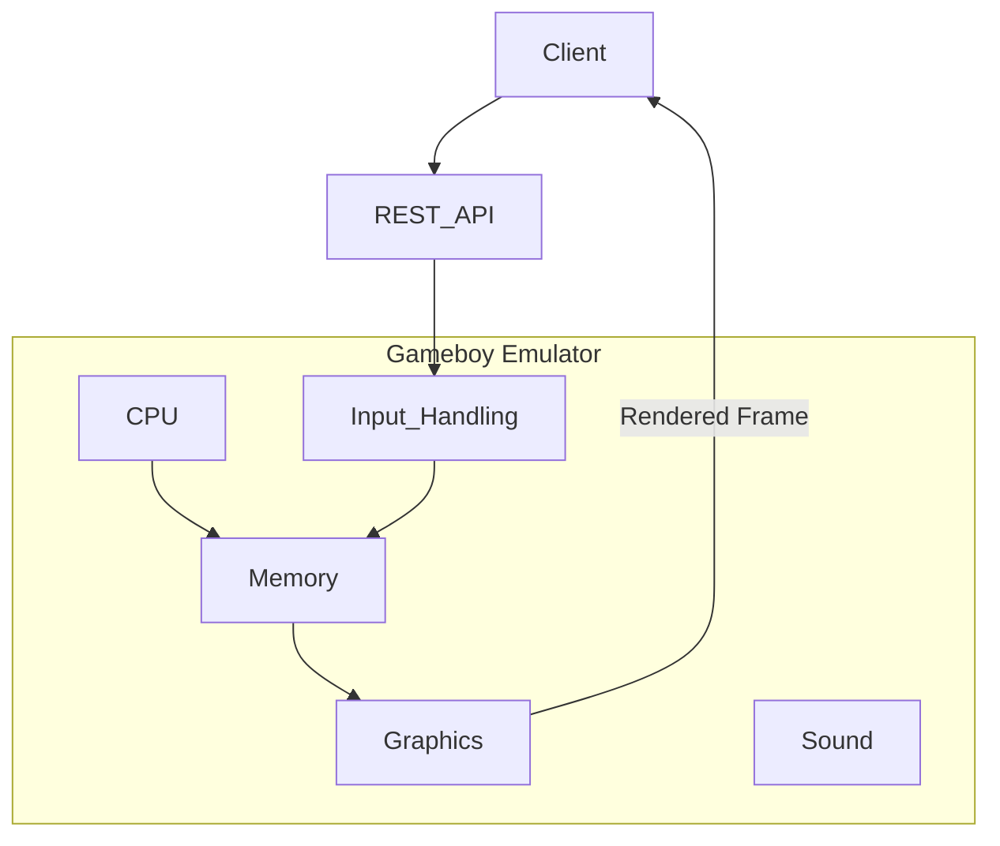

# Purpose

A GAMEBOY emulator that exposes a REST API to control a ROM being played.

**Ultimate Goal**: Play Pokemon RED/BLUE using REST API calls to control the game. And have a GUI navigation agent finish the game.

# Features
- Gameboy emulator implemented in `emulator` directory. This is going to be a Python project. We should keep the implementation simple and create a minimal emulator that emulates: CPU, graphics, sound and input. (Not interested in emulating Gameboy peripherals.)
- REST api (service) is allowed to be the only mode for input. Ex. JSON payload that tells the emulator to invoke control inputs such as left, right, up, down, etc.
- Graphics should support ROMS that had super gameboy (color) features. (Pokemon Red/Blue are examples)

**Processing Model**: The target games (like Pokemon Red/Blue) progress slowly through discrete actions rather than real-time interactions. The emulator does not need to process at high frame rates or handle concurrent timing requirements.



# Gameboy Hardware

Here are the technical specifications of the Gameboy hardware.

## Technical Specifications

|Component|Game Boy|
|---------|--------|
|CPU|8-bit 8080 Sharp CPU (SM83 core)|
|Master Clock|4.194 MHz|
|System Clock|1/4 of the master clock|
|RAM|8 KiB|
|Video RAM|8 KiB|
|Resolution|160 px x 144 px|
|OBJ Sprites|8x8 or 8x16, max: 40 per screen, 10 per line|
|Color Palettes|BG: 1x4, OBJ: 2x3|
|Colors|4 shades of green|
|Horizontal Sync|9.198 KHz|
|Vertical Sync|59.73 Hz|
|Sound|4 channels with stereo output|

## CPU Registers

The Game Boy CPU has the following registers:

**8-bit registers:**
- A (Accumulator)
- B
- C
- D
- E
- H
- L

**16-bit register pairs:**
- AF (A + Flags)
- BC (B + C)
- DE (D + E)
- HL (H + L)

**Special 16-bit registers:**
- SP (Stack Pointer)
- PC (Program Counter)

| 16-bit | Hi | Lo | Name/Function |
|--------|----|----|---------------|
| AF     | A  | -  | Accumulator & Flags |
| BC     | B  | C  | BC |
| DE     | D  | E  | DE |
| HL     | H  | L  | HL |
| SP     | -  | -  | Stack Pointer |
| PC     | -  | -  | Program Counter/Pointer |


### Flags Register (Lower 8 bits of AF register)

| Bit | Name | Explanation |
|-----|------|-------------|
| 7   | z    | Zero flag |
| 6   | n    | Subtraction flag (BCD) |
| 5   | h    | Half Carry flag (BCD) |
| 4   | c    | Carry flag |

# CPU Implementation Deep Dive

This section is a comprehensive guide for anyone onboarding to the CPU codebase. It explains the architecture, the execution model, how to read the code, how to implement new opcodes, and the tricky parts that will trip you up if you're not careful.

## Reading the Code: Where to Start

**`gb_cpu.py` is NOT structured top-down.** If you open it and start reading from line 1, you'll see:

1. A tiny `Registers` class (6 fields)
2. ~250 lines of imports from handler files
3. The `Interrupts` class
4. The `CPU` class with a massive dispatch table
5. Register/flag accessor methods
6. The `run()` method at the very bottom

The natural instinct is to read top-to-bottom. Don't. Here's the recommended reading order:

### Step 1: Understand the execution loop (`run()` at line 936)

This is the heart of the CPU. Everything else exists to serve this method. Read it first, and you'll understand the entire architecture.

### Step 2: Look at the dispatch table (`opcode_handlers` at line 382)

This is the map from opcode byte values to handler functions. It answers: "when the CPU encounters byte `0x80`, what function runs?"

### Step 3: Pick one simple handler and trace through it

Start with `nop` in `misc_handlers.py` (the simplest possible handler), then look at `add_a_b` in `arith_handlers.py` (a typical handler that reads registers, computes, sets flags).

### Step 4: Read the Opcodes.json structure

Open `Opcodes.json` and look at one entry. This is where the CPU gets its instruction metadata (byte count, cycle count, operand layout).

### Step 5: Then read the interrupt system

Only after you understand normal instruction execution should you look at the interrupt machinery. It's layered on top of the basic fetch-decode-execute loop.

## The Execution Loop

The `run()` method implements a classic **fetch-decode-execute** cycle. Here's what happens on each iteration, in plain English:

```
1. Check if we've used enough cycles (budget check)
2. If CPU is halted, idle until an interrupt wakes it
3. Check for pending interrupts and service them if IME is set
4. Fetch the opcode byte from memory[PC], advance PC
5. Look up the opcode in Opcodes.json to get metadata
6. For each operand in the metadata:
   - If it has a "bytes" field: fetch that many bytes from the instruction stream
   - If it's a register: just record the register name
7. Dispatch to the handler function
8. The handler returns a cycle count; accumulate it
9. Handle any delayed EI (interrupt enable)
10. Loop back to step 1
```

### The cycle budget

```python
def run(self, max_cycles=-1):
    while True:
        if max_cycles >= 0 and self.current_cycles >= max_cycles:
            break
```

`current_cycles` is cumulative across multiple `run()` calls. It tracks the total cycles the CPU has consumed since creation. The `max_cycles` parameter says "stop when you've reached this total." This means if you call `run(max_cycles=8)` twice, the second call does nothing — the CPU already consumed 8 cycles on the first call.

This is a common gotcha in tests. If your test calls `run()` multiple times, remember that `current_cycles` doesn't reset between calls.

### Fetch and decode

```python
opcode = self.fetch()  # Read memory[PC], PC += 1

if opcode == 0xCB:
    # CB prefix: fetch second byte, look up in cbprefixed table
    opcode = self.fetch_byte(self.registers.PC)
    self.registers.PC += 1
    opcode_info = self.opcodes_db["cbprefixed"].get(f"0x{opcode:02X}")
else:
    opcode_info = self.opcodes_db["unprefixed"].get(f"0x{opcode:02X}")
```

The CPU reads one byte. If it's `0xCB`, it reads a second byte and uses the CB-prefixed table. Otherwise, it uses the unprefixed table. The `opcode_info` dictionary comes directly from `Opcodes.json` and contains the instruction's mnemonic, operand list, cycle count(s), and flag effects.

### The operand pipeline

This is the most subtle part of the execution loop. Before calling the handler, the `run()` loop pre-fetches all operands into `cpu.operand_values`:

```python
self.operand_values = []

for operand in opcode_info["operands"]:
    if "bytes" in operand:
        # This operand needs data from the instruction stream
        # Fetch 1 or 2 bytes, advance PC
        fetched_value = self.fetch_byte(self.registers.PC)  # or fetch_word
        self.registers.PC += operand["bytes"]
        self.operand_values.append({
            "name": operand["name"],
            "value": fetched_value,
            "immediate": operand["immediate"],
            "type": "immediate_value" or "immediate_address",
        })
    else:
        # Register operand — no bytes to fetch
        self.operand_values.append({
            "name": operand["name"],      # e.g. "B", "HL"
            "value": operand["name"],      # same as name for registers
            "immediate": operand["immediate"],
            "type": "register" or "register_indirect",
        })
```

By the time the handler runs, `cpu.operand_values` is a list of dictionaries with everything the handler needs. The handler never touches `PC` or fetches bytes — that's all done for it.

**The key insight:** The `"bytes"` field in `Opcodes.json` is what determines whether an operand needs data fetched from memory. NOT the `"immediate"` field. The `"immediate"` field means something different — see the gotchas section below.

### Dispatch

```python
if is_cb_prefix:
    handler = self.cb_opcode_handlers.get(opcode)
else:
    handler = self.opcode_handlers.get(opcode)

cycles_used = handler(self, opcode_info)
self.current_cycles += cycles_used
```

Two dispatch tables. Unprefixed handlers are individual function references (one per opcode). CB-prefixed handlers are a generated table mapping 256 entries to just 11 functions.

## Understanding Opcodes.json

Every instruction the CPU can execute is described in `Opcodes.json`. Here's a representative entry:

```json
"0x86": {
    "mnemonic": "ADD",
    "bytes": 1,
    "cycles": [8],
    "operands": [
        {"name": "A", "immediate": true},
        {"name": "HL", "immediate": false}
    ],
    "flags": {"Z": "Z", "N": "0", "H": "H", "C": "C"}
}
```

This is `ADD A, (HL)` — add the byte at memory address HL to register A.

### Decoding the fields

| Field | Meaning |
|-------|---------|
| `mnemonic` | The assembly instruction name |
| `bytes` | Total instruction size including opcode (1 = no operand bytes, 2 = 1 operand byte, 3 = 2 operand bytes) |
| `cycles` | Array of cycle counts. One entry for unconditional, two for conditional (taken/not-taken) |
| `operands` | List of operand descriptors |
| `flags` | How each flag is affected: `"-"` = unchanged, `"0"` = cleared, `"1"` = set, `"Z"/"H"/"C"` = computed |

### The `immediate` field (this WILL confuse you)

The `"immediate"` field on an operand does NOT mean "fetch from instruction stream." It means:

- **`true` on a register** = direct register reference (e.g., `A` in `ADD A, B`)
- **`false` on a register** = register indirect / memory access (e.g., `HL` in `ADD A, (HL)` means "the byte at memory[HL]")
- **`true` on a data operand** = immediate value (e.g., `n8` in `ADD A, 0x42`)
- **`false` on a data operand** = memory address (e.g., `a16` in `LD A, (0xFF80)`)

The ONLY way to know if an operand needs bytes fetched from the instruction stream is the `"bytes"` field. If `"bytes"` is present, fetch that many bytes. If absent, it's a register — no fetching needed.

### Conditional cycle counts

Conditional instructions (JP NZ, CALL Z, RET NC, JR C, etc.) have two cycle counts:

```json
"0xC2": {
    "mnemonic": "JP",
    "cycles": [16, 12],
    "operands": [{"name": "NZ", "immediate": true}, {"name": "a16", "bytes": 2, ...}]
}
```

- `cycles[0]` = 16 = condition met, jump taken
- `cycles[1]` = 12 = condition not met, fall through

The handler checks the flag and returns the appropriate cycle count.

## Implementing an Opcode: Step by Step

### Example 1: The simplest handler (NOP)

`NOP` does nothing. It exists in `misc_handlers.py`:

```python
def nop(cpu, opcode_info):
    """NOP - No operation"""
    return opcode_info["cycles"][0]
```

That's it. No register changes, no flags, just return the cycle count (4).

To wire it up, it's imported in `gb_cpu.py` and added to the dispatch table:

```python
from src.cpu.handlers.misc_handlers import nop
# ...
self.opcode_handlers = {
    0x00: nop,
    # ...
}
```

### Example 2: A typical arithmetic handler (ADD A, B)

```python
def add_a_b(cpu, opcode_info) -> int:
    """ADD A, B - Add B to A"""
    a = cpu.get_register("A")
    b = cpu.get_register("B")
    result = a + b

    cpu.set_flag("Z", (result & 0xFF) == 0)
    cpu.set_flag("N", False)
    cpu.set_flag("H", ((a & 0xF) + (b & 0xF)) > 0xF)
    cpu.set_flag("C", result > 0xFF)

    cpu.set_register("A", result & 0xFF)
    return opcode_info["cycles"][0]
```

The pattern: read registers, compute, set flags, write result, return cycles.

### Example 3: A handler with an immediate operand (ADD A, n8)

```python
def add_a_n8(cpu, opcode_info) -> int:
    """ADD A, n8 - Add immediate byte to A"""
    a = cpu.get_register("A")
    n8 = cpu.operand_values[1]["value"]  # Pre-fetched by the run loop
    result = a + n8
    # ... set flags, write result ...
    return opcode_info["cycles"][0]
```

The immediate value is already in `cpu.operand_values` — the run loop fetched it. The handler just reads it. Note that `operand_values[0]` is register A (the first operand in `Opcodes.json`), and `operand_values[1]` is the immediate byte.

### Example 4: A conditional handler (JP NZ, a16)

```python
def jp_nz_nn(cpu, opcode_info) -> int:
    """JP NZ, a16 - Jump if Z flag not set"""
    addr = cpu.operand_values[0]["value"]
    if not cpu.get_flag("Z"):
        cpu.registers.PC = addr
        return opcode_info["cycles"][0]  # Taken: 16 cycles
    return opcode_info["cycles"][1]      # Not taken: 12 cycles
```

Two return paths, two cycle counts. Notice the condition code operand ("NZ") is NOT in `operand_values` — the run loop filters it out. The first operand the handler sees is the address.

### The 4-step process for any new opcode

1. **Look up the opcode in Opcodes.json** — get the mnemonic, operands, cycles, flags
2. **Write the handler function** in the appropriate `handlers/*.py` file
3. **Import and register** in `gb_cpu.py`'s dispatch table
4. **Write tests** verifying register state, flags, PC advancement, and cycle count

## The Interrupt System

Interrupts are the most complex part of the CPU. They break the clean fetch-decode-execute model by injecting external events between instructions.

### How interrupts work

The Game Boy has 5 interrupt sources, checked in priority order:

| Priority | Type | IF bit | Handler Address |
|----------|------|--------|-----------------|
| 1 (highest) | V-Blank | bit 0 | 0x0040 |
| 2 | LCD STAT | bit 1 | 0x0048 |
| 3 | Timer | bit 2 | 0x0050 |
| 4 | Serial | bit 3 | 0x0058 |
| 5 (lowest) | Joypad | bit 4 | 0x0060 |

Two memory-mapped registers control interrupts:
- **IF (0xFF0F)**: Interrupt Flag — which interrupts are pending (hardware sets these bits)
- **IE (0xFFFF)**: Interrupt Enable — which interrupts the program wants to receive

An interrupt fires when: `IME == true` AND `(IF & IE) != 0` for that bit.

### The interrupt service routine

When an interrupt fires, the CPU:
1. Disables IME (prevents nested interrupts)
2. Pushes the current PC onto the stack
3. Jumps to the handler address
4. Clears the IF bit for that interrupt
5. Consumes 20 cycles

The game's interrupt handler routine eventually executes `RETI`, which pops the return address and re-enables IME.

### Where interrupts happen in the execution loop

```python
while True:
    # 1. Budget check
    if self.current_cycles >= max_cycles:
        break

    # 2. HALT idle loop (if halted, spin until interrupt pending)
    if self.interrupts.halted:
        # ...

    # 3. >>> INTERRUPT CHECK HAPPENS HERE <<<
    if self.interrupts.ime:
        interrupt_cycles = self.interrupts.check_interrupts(self)
        if interrupt_cycles > 0:
            self.current_cycles += interrupt_cycles
            continue  # Don't fetch an instruction this iteration

    # 4. Normal fetch-decode-execute
    opcode = self.fetch()
    # ...
```

Interrupts are checked **between** instructions, never in the middle of one. If an interrupt fires, the CPU skips the normal instruction fetch and loops back to the top.

### Why interrupts are difficult

#### Gotcha 1: The EI delay

The `EI` instruction (Enable Interrupts) does NOT enable interrupts immediately. It sets a `ime_pending` flag, and interrupts actually become enabled **after the next instruction executes**. This is faithful to real hardware — games rely on it to execute one more instruction (usually a `RET`) before interrupts can fire.

The implementation uses a three-phase check in the run loop:

```python
# Before instruction: snapshot the pending state
ime_was_pending = self.interrupts.ime_pending

# ... execute instruction ...

# After instruction: if EI was pending before AND still pending now, enable IME
if ime_was_pending and self.interrupts.ime_pending and not self.interrupts.ime_handled_by_instruction:
    self.interrupts.ime = True
    self.interrupts.ime_pending = False
```

The `ime_handled_by_instruction` flag exists because HALT can promote `ime_pending` to `ime` itself, and we don't want the post-instruction check to double-apply it.

#### Gotcha 2: DI cancels pending EI

If the instruction following `EI` is `DI`, the pending enable is canceled. The DI handler clears both `ime` and `ime_pending`:

```python
def di(cpu, opcode_info):
    cpu.interrupts.ime = False
    cpu.interrupts.ime_pending = False  # Cancel pending EI
    return opcode_info["cycles"][0]
```

The post-instruction check in `run()` handles this naturally: `ime_pending` is no longer set, so the `if` condition fails.

#### Gotcha 3: The HALT bug

When `HALT` executes with `IME=0` and there's a pending interrupt (`IF & IE != 0`), the CPU doesn't actually halt AND doesn't service the interrupt. Instead, it has a bug: the next instruction byte is **read twice**. The byte after HALT is fetched, but PC doesn't advance past it — so it gets fetched again as the start of the next instruction.

```python
# In the HALT handler:
if pending and not ime_effective:
    cpu.interrupts.halt_bug = True  # Set the bug flag

# In the run loop, after fetching the next opcode:
if self.interrupts.halt_bug:
    self.registers.PC = (self.registers.PC - 1) & 0xFFFF  # Undo PC increment
    self.interrupts.halt_bug = False
```

This is a real hardware quirk that games (including Pokemon) can trigger.

#### Gotcha 4: HALT with IME=1 and pending interrupt

When HALT executes with `IME=1` and an interrupt is already pending, the CPU doesn't actually enter halt mode — it immediately services the interrupt. The HALT handler detects this case and calls `service_interrupt` directly, returning `4 (HALT) + 20 (interrupt) = 24` cycles.

#### Gotcha 5: HALT idle consumes cycles

When the CPU is halted with no pending interrupts, it doesn't freeze — it spins in an idle loop consuming 4 cycles per iteration until an interrupt becomes pending. This matters for cycle-accurate timing:

```python
if self.interrupts.halted:
    if if_reg & ie_reg:
        self.interrupts.halted = False  # Wake up
    else:
        self.current_cycles += 4  # Idle cycle
        continue
```

### Interrupt state flags summary

| Flag | Set by | Cleared by | Meaning |
|------|--------|------------|---------|
| `ime` | Post-EI delay, RETI | DI, interrupt service | Master enable: can interrupts fire? |
| `ime_pending` | EI handler | DI handler, post-instruction promotion | EI was executed, waiting one instruction |
| `halted` | HALT handler | Interrupt pending (IF & IE), service_interrupt | CPU is in low-power halt |
| `halt_bug` | HALT handler (IME=0 + pending) | Run loop (consumed after one fetch) | Next byte will be read twice |
| `ime_handled_by_instruction` | HALT handler | Run loop (reset each iteration) | Prevents double-promotion of ime_pending |

## CB-Prefixed Instructions: A Case Study in Data-Driven Design

The CB-prefixed instruction set is the best example of how our architecture handles complexity. 256 opcodes are covered by just 11 handler functions and a generated dispatch table.

### What are CB-prefixed instructions?

The SM83 CPU has 256 "unprefixed" opcodes (one byte each). But 256 isn't enough for all the operations the CPU needs. So the designers reserved one opcode — `0xCB` — as an escape prefix. When the CPU encounters `0xCB`, it reads the next byte and uses it as an index into a second 256-entry table.

This doubles the effective instruction set from 256 to 512 opcodes, providing full bit manipulation, shifts, and rotates on all registers — not just the accumulator.

### The CB opcode encoding scheme

The second byte after `0xCB` encodes both the operation and the target:

```
Bits 7-6: Operation group
Bits 5-3: Operation subtype (for groups 01/10/11: bit number)
Bits 2-0: Target register
```

**Target encoding (bits 2-0):**

| Bits | Target |
|------|--------|
| 000 | B |
| 001 | C |
| 010 | D |
| 011 | E |
| 100 | H |
| 101 | L |
| 110 | (HL) — memory indirect |
| 111 | A |

**Operation groups:**

| Byte range | Bits 7-6 | Bits 5-3 | Operation |
|------------|----------|----------|-----------|
| 0x00-0x3F | 00 | 0-7 | Rotate/shift/swap (8 operations) |
| 0x40-0x7F | 01 | bit# | BIT — test bit |
| 0x80-0xBF | 10 | bit# | RES — clear bit |
| 0xC0-0xFF | 11 | bit# | SET — set bit |

The rotate/shift group (0x00-0x3F) encodes 8 different operations in bits 5-3:

| Bits 5-3 | Operation | Mnemonic |
|----------|-----------|----------|
| 0 | Rotate left circular | RLC |
| 1 | Rotate right circular | RRC |
| 2 | Rotate left through carry | RL |
| 3 | Rotate right through carry | RR |
| 4 | Shift left arithmetic | SLA |
| 5 | Shift right arithmetic | SRA |
| 6 | Swap nibbles | SWAP |
| 7 | Shift right logical | SRL |

### Cycle counts

| Target | Rotate/Shift/SWAP | BIT | RES/SET |
|--------|-------------------|-----|---------|
| Register (B,C,D,E,H,L,A) | 8 | 8 | 8 |
| (HL) memory indirect | 16 | 12 | 16 |

BIT on (HL) is only 12 cycles (not 16) because it reads memory but doesn't write back.

### Difference from unprefixed rotates

The Game Boy has 4 unprefixed rotate instructions: RLCA (0x07), RRCA (0x0F), RLA (0x17), RRA (0x1F). These ONLY operate on register A, and they always clear the Z flag — even if A becomes zero.

The CB-prefixed versions (RLC, RRC, RL, RR) operate on **any** of the 8 targets and **set Z if the result is zero**. This is a common source of bugs: if you accidentally reuse the unprefixed rotate logic for CB rotates, the Z flag behavior will be wrong.

### The data-driven implementation

Instead of writing 256 individual handler functions, we use two key observations:

1. **All targets are resolved the same way.** The `Opcodes.json` entry for each CB opcode includes the target as an operand with `"immediate": true` for registers and `"immediate": false` for (HL). The run loop pre-fetches this into `cpu.operand_values`.

2. **The 11 operations have identical structure.** Read target, compute, write target, set flags, return cycles.

This leads to two small helper functions that all 11 handlers share:

```python
def _read_target(cpu, operand):
    """Read value from a CB target (register or memory at HL)."""
    if operand["immediate"]:
        return cpu.get_register(operand["name"])
    else:
        return cpu.memory.get_value(cpu.get_register("HL"))

def _write_target(cpu, operand, value):
    """Write value to a CB target (register or memory at HL)."""
    if operand["immediate"]:
        cpu.set_register(operand["name"], value)
    else:
        cpu.memory.set_value(cpu.get_register("HL"), value)
```

Each handler is then just the operation logic. For example, `RLC`:

```python
def cb_rlc(cpu, opcode_info):
    """RLC - Rotate left circular. Bit 7 goes to carry and bit 0."""
    operand = cpu.operand_values[0]
    value = _read_target(cpu, operand)
    carry = (value >> 7) & 1
    result = ((value << 1) | carry) & 0xFF
    _write_target(cpu, operand, result)
    cpu.set_flag('Z', result == 0)
    cpu.set_flag('N', False)
    cpu.set_flag('H', False)
    cpu.set_flag('C', carry == 1)
    return opcode_info['cycles'][0]
```

This single function handles `RLC B`, `RLC C`, `RLC D`, `RLC E`, `RLC H`, `RLC L`, `RLC (HL)`, and `RLC A` — 8 opcodes. The operand name and `immediate` flag distinguish registers from (HL). The correct cycle count (8 for registers, 16 for (HL)) comes from `Opcodes.json` automatically.

BIT, RES, and SET are slightly different because they have two operands — the bit number and the target:

```python
def cb_bit(cpu, opcode_info):
    """BIT n - Test bit n. Z flag set if bit is 0."""
    bit_num = int(cpu.operand_values[0]["name"])  # "0" through "7"
    operand = cpu.operand_values[1]               # The target register/(HL)
    value = _read_target(cpu, operand)
    cpu.set_flag('Z', (value & (1 << bit_num)) == 0)
    cpu.set_flag('N', False)
    cpu.set_flag('H', True)
    return opcode_info['cycles'][0]
```

This single function handles all 64 BIT opcodes (8 bits x 8 targets).

### The dispatch table generator

The 256-entry dispatch table is built programmatically:

```python
def build_cb_dispatch():
    table = {}
    # Opcodes 0x00-0x3F: 8 rotate/shift/swap ops x 8 targets
    rotate_shift_ops = [cb_rlc, cb_rrc, cb_rl, cb_rr, cb_sla, cb_sra, cb_swap, cb_srl]
    for op_idx, handler in enumerate(rotate_shift_ops):
        for target_idx in range(8):
            table[op_idx * 8 + target_idx] = handler
    # Opcodes 0x40-0x7F: BIT (64 entries)
    for i in range(64):
        table[0x40 + i] = cb_bit
    # Opcodes 0x80-0xBF: RES (64 entries)
    for i in range(64):
        table[0x80 + i] = cb_res
    # Opcodes 0xC0-0xFF: SET (64 entries)
    for i in range(64):
        table[0xC0 + i] = cb_set
    return table
```

The CPU stores this as `self.cb_opcode_handlers` and uses it during dispatch:

```python
if is_cb_prefix:
    handler = self.cb_opcode_handlers.get(opcode)
else:
    handler = self.opcode_handlers.get(opcode)
```

**The result:** 256 opcodes, 11 handler functions, 2 helpers, 1 table generator. All cycle-accurate, all tested against Opcodes.json.

### Naming convention

CB handler functions are prefixed with `cb_` to avoid collisions with the unprefixed rotate instructions: `cb_rlc` vs `rlc_a`, `cb_rr` vs `rr_a`. This matters because the unprefixed versions have different flag behavior (they always clear Z).

## Tips and Tricks

### Tip 1: Use Opcodes.json as your source of truth

Before implementing any opcode, look it up in `Opcodes.json`. Don't rely on memory or external references for cycle counts, flag behavior, or operand layout. We have a test suite (`test_cycle_accuracy.py`) that validates every opcode's cycle count against this file.

### Tip 2: Watch out for the "C" ambiguity

In `Opcodes.json`, the operand name `"C"` can mean register C or the carry flag condition code. The run loop handles this by skipping condition code operands for conditional instructions:

```python
is_conditional = len(opcode_info.get("cycles", [])) > 1
if is_conditional and operand_name in ["Z", "NZ", "C", "NC"]:
    pass  # Skip — these are condition codes, not register operands
```

If you remove the `is_conditional` guard, `LD C, n8` breaks because register C gets skipped.

### Tip 3: Remember that `current_cycles` is cumulative

`cpu.current_cycles` never resets. If a test calls `run(max_cycles=12)` and then `run(max_cycles=24)`, the second call has a budget of 12 more cycles (from 12 to 24), not 24 from scratch.

### Tip 4: Flag calculation is always on the masked result

For 8-bit operations, always mask to `& 0xFF` before checking the zero flag. Python integers are arbitrary precision, so `0xFF + 1 = 256`, which is not zero — but the Game Boy's 8-bit register would contain `0x00`.

### Tip 5: Verify opcode-to-mnemonic mappings

A previous mistake mapped `0x27` to a rotate handler. It's actually DAA (Decimal Adjust Accumulator). The opcodes in the `0x27`/`0x2F`/`0x37`/`0x3F` row are NOT rotates — they're DAA, CPL, SCF, CCF. Always cross-check against `Opcodes.json`.

## File Organization

### Source files

| File | Purpose |
|------|---------|
| `src/cpu/gb_cpu.py` | `Registers`, `Interrupts`, `CPU` classes, dispatch tables, execution loop |
| `src/cpu/handlers/arith_handlers.py` | ADD, ADC, SUB, SBC, ADD SP instructions |
| `src/cpu/handlers/bitwise_handlers.py` | AND, OR, XOR, CP instructions |
| `src/cpu/handlers/cb_handlers.py` | All 256 CB-prefixed instructions (11 handlers + dispatch generator) |
| `src/cpu/handlers/inc_dec_handlers.py` | INC, DEC (8-bit, 16-bit, and (HL) indirect) |
| `src/cpu/handlers/interrupt_handlers.py` | DI, EI, HALT |
| `src/cpu/handlers/jump_handlers.py` | JP, JR, CALL, RET, RETI, RST |
| `src/cpu/handlers/ld_handlers.py` | LD immediate, indirect, absolute, auto-inc/dec |
| `src/cpu/handlers/ld_r1_r2_handlers.py` | LD r1, r2 register-to-register (56 instructions) |
| `src/cpu/handlers/ldh_handlers.py` | LDH high-memory I/O instructions |
| `src/cpu/handlers/misc_handlers.py` | NOP, STOP, SCF, CCF, CPL, DAA |
| `src/cpu/handlers/rotate_handlers.py` | RLCA, RRCA, RLA, RRA (unprefixed A-only rotates) |
| `src/cpu/handlers/stack_handlers.py` | PUSH, POP |
| `Opcodes.json` | Authoritative opcode reference (~2.5MB) |

### Test files

| File | What it tests |
|------|---------------|
| `tests/cpu/test_cycle_accuracy.py` | Every opcode's cycle count vs Opcodes.json (~500 checks) |
| `tests/cpu/test_cb_opcodes.py` | CB-prefixed operations: all 11 types, register + (HL) targets, flags |
| `tests/cpu/test_interrupts.py` | Interrupt system: EI delay, HALT, HALT bug, priority, chaining |
| `tests/cpu/test_jump_instructions.py` | JP, JR, CALL, RET, RETI, RST |
| `tests/cpu/test_bitwise_ops.py` | AND, OR, XOR, CP |
| `tests/cpu/test_rotate_ops.py` | RLCA, RRCA, RLA, RRA |
| `tests/cpu/test_ld_r1_r2.py` | Register-to-register LD instructions |
| `tests/cpu/test_load_store.py` | LD immediate, indirect, absolute, auto-inc/dec |
| `tests/cpu/test_remaining_opcodes.py` | Conditional JP, ADC n8, ADD SP, DAA |
| `tests/cpu/test_fetch_with_operands.py` | Opcodes with operands |
| `tests/cpu/test_fetch_opcodes_only.py` | Opcodes without operands |
| `tests/cpu/test_registers.py` | Register access |
| `tests/cpu/test_stack.py` | Stack operations |
| `tests/cpu/test_flags.py` | Flag manipulation |

### Running tests

```bash
# All CPU tests (388 tests)
python -m unittest discover tests/cpu -v

# Specific test file
python -m unittest tests.cpu.test_cycle_accuracy -v

# Specific test method
python -m unittest tests.cpu.test_cb_opcodes.TestCBRLC.test_rlc_b -v
```
