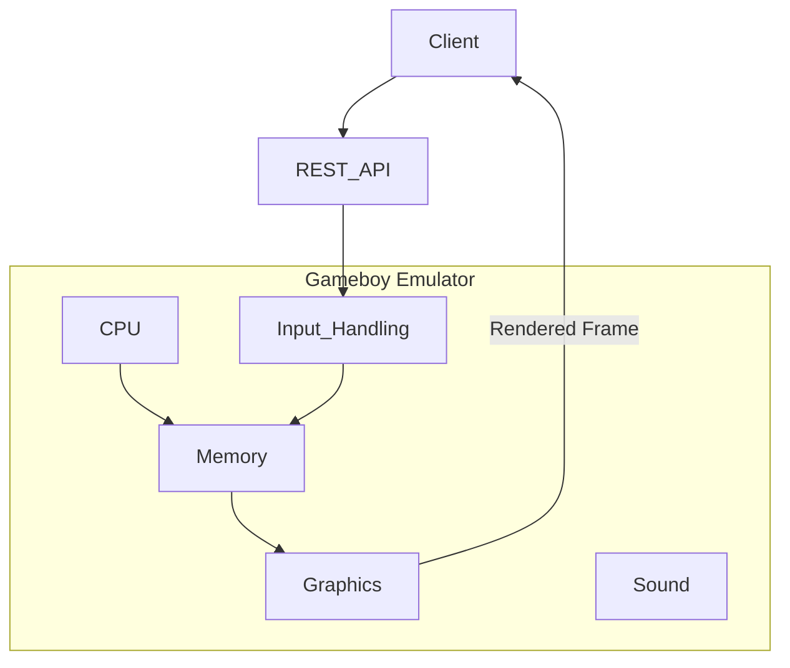

# Purpose

A GAMEBOY emulator that exposes a REST API to control a ROM being played.

**Ultimate Goal**: Play Pokemon RED/BLUE using REST API calls to control the game. And have a GUI navigation agent finish the game.

# Features
- Gameboy emulator implemented in `emulator` directory. This is going to be a Python project. We should keep the implementation simple and create a minimal emulator that emulates: CPU, graphics, sound and input. (Not interested in emulating Gameboy peripherals.)
- REST api (service) is allowed to be the only mode for input. Ex. JSON payload that tells the emulator to invoke control inputs such as left, right, up, down, etc.
- Graphics should support ROMS that had super gameboy (color) features. (Pokemon Red/Blue are examples)

**Processing Model**: The target games (like Pokemon Red/Blue) progress slowly through discrete actions rather than real-time interactions. The emulator does not need to process at high frame rates or handle concurrent timing requirements.



# Gameboy Hardware

Here are the technical specifications of the Gameboy hardware.

## Technical Specifications

|Component|Game Boy|
|---------|--------|
|CPU|8-bit 8080 Sharp CPU (SM83 core)|
|Master Clock|4.194 MHz|
|System Clock|1/4 of the master clock|
|RAM|8 KiB|
|Video RAM|8 KiB|
|Resolution|160 px x 144 px|
|OBJ Sprites|8x8 or 8x16, max: 40 per screen, 10 per line|
|Color Palettes|BG: 1x4, OBJ: 2x3|
|Colors|4 shades of green|
|Horizontal Sync|9.198 KHz|
|Vertical Sync|59.73 Hz|
|Sound|4 channels with stereo output|

## CPU Registers

The Game Boy CPU has the following registers:

**8-bit registers:**
- A (Accumulator)
- B
- C
- D
- E
- H
- L

**16-bit register pairs:**
- AF (A + Flags)
- BC (B + C)
- DE (D + E)
- HL (H + L)

**Special 16-bit registers:**
- SP (Stack Pointer)
- PC (Program Counter)

| 16-bit | Hi | Lo | Name/Function |
|--------|----|----|---------------|
| AF     | A  | -  | Accumulator & Flags |
| BC     | B  | C  | BC |
| DE     | D  | E  | DE |
| HL     | H  | L  | HL |
| SP     | -  | -  | Stack Pointer |
| PC     | -  | -  | Program Counter/Pointer |


### Flags Register (Lower 8 bits of AF register)

| Bit | Name | Explanation |
|-----|------|-------------|
| 7   | z    | Zero flag |
| 6   | n    | Subtraction flag (BCD) |
| 5   | h    | Half Carry flag (BCD) |
| 4   | c    | Carry flag |

# CPU Implementation Details

## Code Structure
- `src/cpu/gb_cpu.py`: Main CPU implementation
  - Contains `Registers`, `Interrupts`, and `CPU` classes
  - Uses dispatch table pattern for opcode handling
  - Operand values pre-fetched into `cpu.operand_values` list by the `run()` loop
  - See `AGENTS.md` "Critical Implementation Notes" for essential rules about the run() loop

- `src/cpu/handlers/`: Handler functions organized by instruction type
  - `arith_handlers.py`: ADD, SUB, SBC instructions
  - `bitwise_handlers.py`: AND, OR, XOR, CP instructions
  - `inc_dec_handlers.py`: INC instructions
  - `jump_handlers.py`: JP, JR, CALL, RET, RETI, RST instructions
  - `ld_handlers.py`: LD (load) immediate instructions
  - `ld_r1_r2_handlers.py`: LD r1, r2 register-to-register loads (0x40-0x7F)
  - `ldh_handlers.py`: LDH high-memory I/O instructions
  - `misc_handlers.py`: NOP and other miscellaneous instructions
  - `rotate_handlers.py`: RLC, RRC, RL, RR (rotate A register)
  - `stack_handlers.py`: PUSH, POP instructions

- `Opcodes.json`: Full Game Boy opcode database. Contains `unprefixed` and `cbprefixed` sections.

- `tests/cpu/`: Unit tests for CPU functionality

## Implementation Patterns

### Opcode Handler Pattern

Handlers are standalone functions (NOT methods). The first parameter is always `cpu`, never `self`:

```python
def handler_name(cpu, opcode_info) -> int:
    """Mnemonic - Brief description"""
    # Access pre-fetched operands from cpu.operand_values
    # Update registers/memory via cpu.set_register(), cpu.memory.set_value()
    # Update flags via cpu.set_flag()
    return opcode_info["cycles"][0]  # or cycles[1] for conditional branch not taken
```

### Dispatch Table Structure

The dispatch table maps opcode byte values to handler function references:

```python
self.opcode_handlers = {
    0x00: nop,
    0x07: rlc_a,
    0xC3: jp_nn,
    # ... other opcodes ...
}
```

Handlers are called as: `handler(self, opcode_info)` where `self` is the CPU instance passed as the `cpu` parameter.

### Testing Approach
- Use unittest framework
- Test files in `tests/cpu/` directory
- Each test verifies:
  - Correct PC advancement based on opcode size
  - Accurate cycle counting
  - Proper register/memory state changes
  - Operand handling for instructions with operands
  - Flag states after execution

## CB-Prefixed Instructions (0xCB + second byte)

The Game Boy has a second opcode table of 256 instructions accessed via the `0xCB` prefix byte. When the CPU fetches `0xCB`, it reads the next byte and uses it as an index into the CB-prefixed table. This gives the SM83 a much richer set of bit manipulation and shift/rotate operations than a typical 8080.

### How CB-prefix decoding works

The `run()` loop already handles this: when it sees opcode `0xCB`, it fetches the second byte, looks it up in `Opcodes.json["cbprefixed"]`, and dispatches to a handler. CB-prefixed instructions need their own dispatch table (separate from `opcode_handlers`).

### Instruction layout

All 256 CB opcodes operate on 8 targets in a fixed order: **B, C, D, E, H, L, (HL), A**. The target is encoded in bits 2-0 of the second byte. The operation is encoded in bits 7-3.

| CB range    | Mnemonic | Count | Description                                      | Flags       |
|-------------|----------|-------|--------------------------------------------------|-------------|
| 0x00-0x07   | RLC      | 8     | Rotate left circular (bit 7 to carry and bit 0)  | Z 0 0 C     |
| 0x08-0x0F   | RRC      | 8     | Rotate right circular (bit 0 to carry and bit 7) | Z 0 0 C     |
| 0x10-0x17   | RL       | 8     | Rotate left through carry                        | Z 0 0 C     |
| 0x18-0x1F   | RR       | 8     | Rotate right through carry                       | Z 0 0 C     |
| 0x20-0x27   | SLA      | 8     | Shift left arithmetic (0 into bit 0)             | Z 0 0 C     |
| 0x28-0x2F   | SRA      | 8     | Shift right arithmetic (bit 7 preserved)         | Z 0 0 C     |
| 0x30-0x37   | SWAP     | 8     | Swap upper and lower nibbles                     | Z 0 0 0     |
| 0x38-0x3F   | SRL      | 8     | Shift right logical (0 into bit 7)               | Z 0 0 C     |
| 0x40-0x7F   | BIT      | 64    | Test bit n (Z set if bit is 0)                   | Z 0 1 -     |
| 0x80-0xBF   | RES      | 64    | Reset (clear) bit n                              | - - - -     |
| 0xC0-0xFF   | SET      | 64    | Set bit n                                        | - - - -     |

### Cycle counts

- Register targets (B, C, D, E, H, L, A): **8 cycles** for all operations
- (HL) memory target: **16 cycles** for most operations, **12 cycles** for BIT

### Difference from unprefixed rotates

The unprefixed rotates (RLCA/RRCA/RLA/RRA at 0x07/0x0F/0x17/0x1F) only operate on register A and always clear the Z flag. The CB-prefixed versions (RLC/RRC/RL/RR) operate on any target and set Z if the result is zero.

### Implementation strategy

Because the CB table is highly regular (11 operations x 8 targets), it lends itself to a data-driven approach: helper functions for each operation type that accept the target name, rather than 256 individual handler functions.

## Handler File Organization

The CPU class imports handler functions from `src/cpu/handlers/` and registers them in the dispatch table. When adding new handlers:

1. Create or add to the appropriate handler file in `src/cpu/handlers/`
2. Import the function in `gb_cpu.py`
3. Add to `self.opcode_handlers` dict with the correct opcode byte key
4. Verify the opcode-to-mnemonic mapping against Opcodes.json before registering
