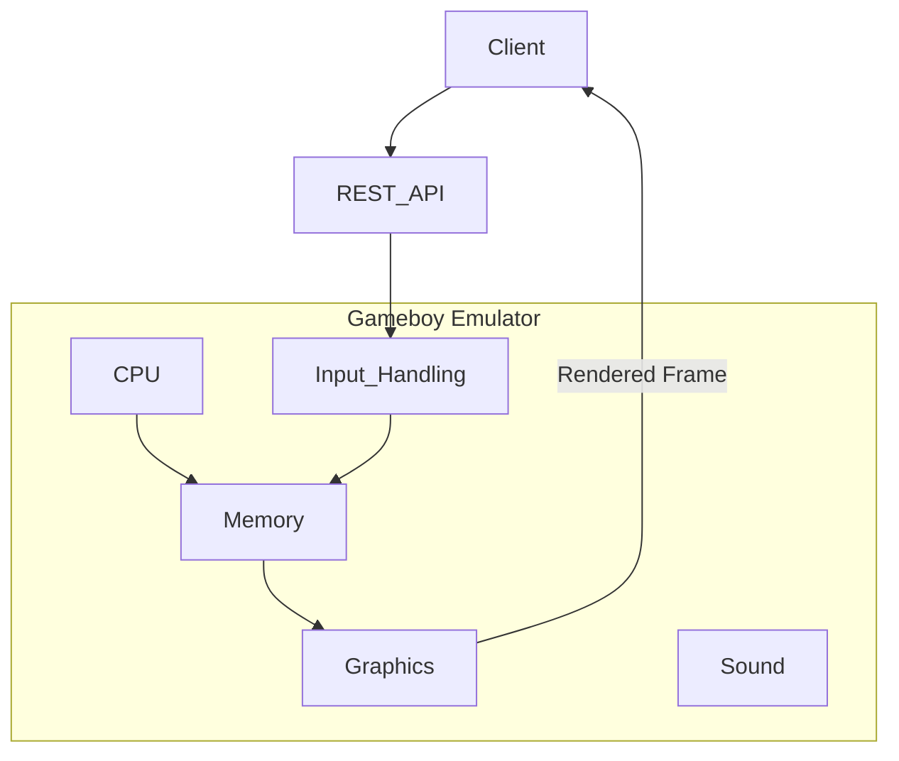

# Purpose

A GAMEBOY emulator that exposes a REST API to control a ROM being played.

**Ultimate Goal**: Play Pokemon RED/BLUE using REST API calls to control the game. And have a GUI navigation agent finish the game.

**Service Context**: The REST API service is intended solely as an interface for a single AI agent, not as a web-scale service. There are no concurrent users or network latency concerns.

# Features
- Gameboy emulator implemented in `emulator` directory. This is going to be a Python project. We should keep the implementation simple and create a minimal emulator that emulates: CPU, graphics, sound and input. (Not interested in emulating Gameboy peripherals.)
- REST api (service) is allowed to be the only mode for input. Ex. JSON payload that tells the emulator to invoke control inputs such as left, right, up, down, etc.
- Graphics should support ROMS that had super gameboy (color) features. (Pokemon Red/Blue are examples)

**Processing Model**: The target games (like Pokemon Red/Blue) progress slowly through discrete actions rather than real-time interactions. The emulator does not need to process at high frame rates or handle concurrent timing requirements.



# Gameboy Hardware

Here are the technical specifications of the Gameboy hardware.

## Technical Specifications

|Component|Game Boy|
|---------|--------|
|CPU|8-bit 8080 Sharp CPU (SM83 core)|
|Master Clock|4.194 MHz|
|System Clock|1/4 of the master clock|
|RAM|8 KiB|
|Video RAM|8 KiB|
|Resolution|160 px x 144 px|
|OBJ Sprites|8x8 or 8x16, max: 40 per screen, 10 per line|
|Color Palettes|BG: 1x4, OBJ: 2x3|
|Colors|4 shades of green|
|Horizontal Sync|9.198 KHz|
|Vertical Sync|59.73 Hz|
|Sound|4 channels with stereo output|

## CPU Registers

| 16-bit | Hi | Lo | Name/Function |
|--------|----|----|---------------|
| AF     | A  | -  | Accumulator & Flags |
| BC     | B  | C  | BC |
| DE     | D  | E  | DE |
| HL     | H  | L  | HL |
| SP     | -  | -  | Stack Pointer |
| PC     | -  | -  | Program Counter/Pointer |


### Flags Register (Lower 8 bits of AF register)

| Bit | Name | Explanation |
|-----|------|-------------|
| 7   | z    | Zero flag |
| 6   | n    | Subtraction flag (BCD) |
| 5   | h    | Half Carry flag (BCD) |
| 4   | c    | Carry flag |

## CPU Instruction Set

All instructions are defined in `Opcodes.json` file. There are unprefixed and cbprefixed instructions.

Definitions:
* **cbprefixed** - Instructions that start with the prefix byte 0xCB, followed by a second byte to determine the specific instruction. This extends the instruction set to provide additional operations like bit manipulation.
* **unprefixed** - Standard 8-bit opcodes ranging from 0x00 to 0xFF that make up the main instruction set of the Gameboy CPU.

The Gameboy CPU uses a two-byte decoding approach:
1. Check if the current opcode is 0xCB (prefix byte)
2. If yes, use the next byte as an index into the prefixed instruction set
3. If no, use the current byte directly in the unprefixed instruction set

This allows for a total of 512 possible instructions (256 unprefixed + 256 cbprefixed).

### Opcodes.json Structure

The `Opcodes.json` file contains metadata for all CPU instructions organized into two top-level objects: `unprefixed` and `cbprefixed`. Each opcode entry is keyed by its hex value (e.g., `"0x00"`, `"0xCB"`) and contains the following fields:

| Field | Type | Description |
|-------|------|-------------|
| `mnemonic` | string | Assembly instruction name (e.g., "NOP", "LD", "JR") |
| `bytes` | number | Total instruction size in bytes, including the opcode and any operands |
| `cycles` | array of numbers | CPU cycles consumed by this instruction. Single element `[4]` for fixed timing. Multiple elements `[8, 12]` for conditional instructions where the first value is the base case (condition false) and subsequent values are for the true case |
| `operands` | array of objects | List of operands for the instruction. Each operand has `name` (register/value name), optional `bytes` (size), and `immediate` (whether it's a direct value vs memory reference) |
| `immediate` | boolean | Whether the instruction uses immediate addressing |
| `flags` | object | How the instruction affects CPU flags (Z, N, H, C). Values: `"-"` (unaffected), `"0"` (reset to 0), `"1"` (set to 1), or the flag letter (e.g., `"Z"`) if the flag is set based on the operation result |

#### Operand Size Constraints

Operands in the Game Boy instruction set are limited to a maximum of 2 bytes due to the 8-bit CPU architecture with a 16-bit address bus:

- **1 byte**: `n8` (8-bit immediate value), `r8` (8-bit relative offset), `e8` (8-bit signed offset)
- **2 bytes**: `n16` (16-bit immediate value), `a16` (16-bit absolute address)
- **0 bytes**: Register operands (A, B, C, D, E, H, L, BC, DE, HL, SP, AF) and condition flags (Z, NZ, C, NC, etc.)

No instruction operand exceeds 2 bytes in size.

**Example - Fixed cycle instruction:**
```json
"0x00": {
  "mnemonic": "NOP",
  "bytes": 1,
  "cycles": [4],
  "operands": [],
  "immediate": true,
  "flags": { "Z": "-", "N": "-", "H": "-", "C": "-" }
}
```

**Example - Conditional instruction with variable cycles:**
```json
"0x20": {
  "mnemonic": "JR",
  "bytes": 2,
  "cycles": [12, 8],
  "operands": [
    { "name": "NZ", "immediate": true },
    { "name": "r8", "bytes": 1, "immediate": true }
  ],
  "immediate": true,
  "flags": { "Z": "-", "N": "-", "H": "-", "C": "-" }
}
```
In this example, the instruction takes 12 cycles if the jump is taken (NZ condition is true), or 8 cycles if not taken.

### CPU Execution Loop Pseudocode

```
while True:
  opcode_obj = fetch_from_prg(_PC)
  
  # Handle prefixed vs unprefixed opcodes
  if opcode_obj[0] == 0xCB:  # Check if it's a prefixed opcode
    # For cbprefixed instructions, we need to fetch the next byte
    opcode_num = opcode_obj[1]  # Use second byte as opcode for prefixed set
  else:
    # For unprefixed instructions, use first byte directly
    opcode_num = opcode_obj[0]
  
  if opcode_num == ...:
    # do stuff here... (implement the opcode)
```


## How we implement each opcode

The emulator uses a **dispatch table** (a Python dictionary) that maps every opcode value to a dedicated handler method on the `CPU` class.

### 1. Decoding & dispatch

The main execution loop in `run()` handles opcode fetching, operand fetching, handler dispatch, and cycle counting. See the full implementation in `src/cpu/gb_cpu.py`.

**Dispatch table structure:**
```python
self.opcode_handlers = {
    0x00: self._nop,
    0x01: self._ld_bc_d16,
    0x06: self._ld_b_n8,
    # ... 256 unprefixed opcodes ...
}
```

### 2. State encapsulation

- **CPU class** holds all execution state:
  - `self.registers` - Registers object with AF, BC, DE, HL, SP, PC
  - `self.current_cycles` - Total CPU cycles executed
  - `self.operand_values` - List of operand dictionaries fetched for current instruction (see Operand Structure below)
  - `self.memory` - Memory object reference
  - `self.opcodes_db` - Loaded opcode metadata from Opcodes.json

- **Memory object** wraps the 64 KB address space with `get_value(addr)` / `set_value(addr, value)` methods
- No module-level globals are used; all state is instance-based for testability

#### Operand Structure

Each element in `self.operand_values` is a dictionary with the following uniform structure:

```python
{
    "name": str,       # Operand name from Opcodes.json (e.g., "n16", "BC", "A", "a16")
    "value": int|str,  # Numeric value (for immediate data/addresses) OR register name string
    "immediate": bool, # From Opcodes.json - whether operand is immediate (True) or indirect (False)
    "type": str        # One of the operand types defined below
}
```

**Operand Types:**

| Type | Description | Examples | immediate | value type |
|------|-------------|----------|-----------|------------|
| `immediate_value` | Numeric data fetched from instruction stream | n8, n16, e8, r8 | True | int |
| `immediate_address` | Numeric address fetched from instruction stream | a16 | True | int |
| `register` | Register operand used directly | A, B, C, BC, DE, HL, SP | True | str |
| `register_indirect` | Register used as memory address | (BC), (DE), (HL) | False | str |

**Examples:**

```python
# LD BC, n16 - operand_values contains:
[
    {"name": "BC", "value": "BC", "immediate": True, "type": "register"},
    {"name": "n16", "value": 0x1234, "immediate": True, "type": "immediate_value"}
]

# LD (BC), A - operand_values contains:
[
    {"name": "BC", "value": "BC", "immediate": False, "type": "register_indirect"},
    {"name": "A", "value": "A", "immediate": True, "type": "register"}
]

# LD A, (a16) - operand_values contains:
[
    {"name": "A", "value": "A", "immediate": True, "type": "register"},
    {"name": "a16", "value": 0xFF80, "immediate": True, "type": "immediate_address"}
]
```

### 3. Handler design

Each opcode has its own handler method that:
1. Receives `opcode_info` as a parameter (for metadata like flags, cycles)
2. Accesses `self.operand_values` for immediate operand data
3. Implements opcode-specific logic with hardcoded behavior (since instruction set is fixed)
4. Returns the number of CPU cycles consumed

**Handler signature:**
```python
def _handler_name(self, opcode_info) -> int:
    """Mnemonic - Brief description"""
    # Access immediate operands from self.operand_values
    # Update registers/memory via self.set_register(), self.memory.set_value()
    return opcode_info["cycles"][0]  # or cycles[1] for conditional branch
```

**Example handlers:**

Simple instruction (NOP):
```python
def _nop(self, opcode_info) -> int:
    """NOP - No operation"""
    return opcode_info["cycles"][0]  # 4 cycles
```

Instruction with operand (LD BC, n16):
```python
def _ld_bc_d16(self, opcode_info) -> int:
    """LD BC, n16 - Load 16-bit immediate into BC"""
    value = self.operand_values[0]  # n16 was fetched into operand_values[0]
    self.set_register('BC', value)
    return opcode_info["cycles"][0]  # 12 cycles
```

Conditional instruction (JR NZ, r8):
```python
def _jr_nz_r8(self, opcode_info) -> int:
    """JR NZ, r8 - Jump relative if Zero flag not set"""
    offset = self.operand_values[0]
    z_flag = (self.get_register('AF') & 0x80) != 0
    
    if not z_flag:  # Jump taken
        if offset > 127:
            offset = offset - 256  # Convert to signed
        self.registers.PC += offset
        return opcode_info["cycles"][0]  # 12 cycles
    else:  # Jump not taken
        return opcode_info["cycles"][1]  # 8 cycles
```

**Key design decisions:**
- **Hardcoded logic**: Since the Game Boy instruction set is fixed and won't expand, handlers use hardcoded logic rather than generic interpretation
- **Cycle return value**: Handlers return cycle count rather than updating `self.current_cycles` directly, separating execution logic from cycle accounting
- **Operand access**: Immediate operand values are pre-fetched into `self.operand_values` by the main loop

### 4. Documentation & testing

- Every handler includes a docstring with the mnemonic and brief description
- Unit tests instantiate `CPU` with test memory, set up instruction bytes, run one cycle, and assert expected state changes
- Tests verify both register/memory changes and correct cycle counts

This approach makes the opcode implementation **readable**, **maintainable**, and **easy to test** for future contributors.

To run unit tests, execute the following command from the project root directory:

```bash
python -m unittest discover tests/
```

All tests are organized under the `tests/` directory structure. The register tests can be found in `tests/cpu/test_registers.py`.

# Memory Map

| Start | End   | Description                          | Notes                                               |
|-------|-------|--------------------------------------|-----------------------------------------------------|
| 0000  | 3FFF  | 16 KiB ROM bank 0                    | From cartridge, usually a fixed bank (if any)       |
| 4000  | 7FFF  | 16 KiB ROM Bank 0-1N                 | From cartridge, switchable bank via mapper (if any) |
| 8000  | 9FFF  | 8 KiB Video RAM (VRAM)               | In CGB mode, switchable bank 0/1                    |
| A000  | BFFF  | 8 KiB External RAM                   | From cartridge, switchable bank if any              |
| C000  | CFFF  | 4 KiB Work RAM (WRAM)                |                                                     |
| D000  | DFFF  | 4 KiB Work RAM (WRAM)                | In CGB mode, switchable bank 1-7                    |
| E000  | FDFF  | Echo RAM (mirror of C000-DDFF)       | Nintendo says use of this area is prohibited.        |
| FE00  | FE9F  | Object attribute memory (OAM)         |                                                     |
| FEA0  | FEFF  | Not Usable                           | Nintendo says use of this area is prohibited.        |
| FF00  | FF7F  | I/O Registers                        |                                                     |
| FF80  | FFFE  | High RAM (HRAM)                      |                                                     |
| FFFF  | FFFF  | Interrupt Enable register (IE)       |                                                     |
