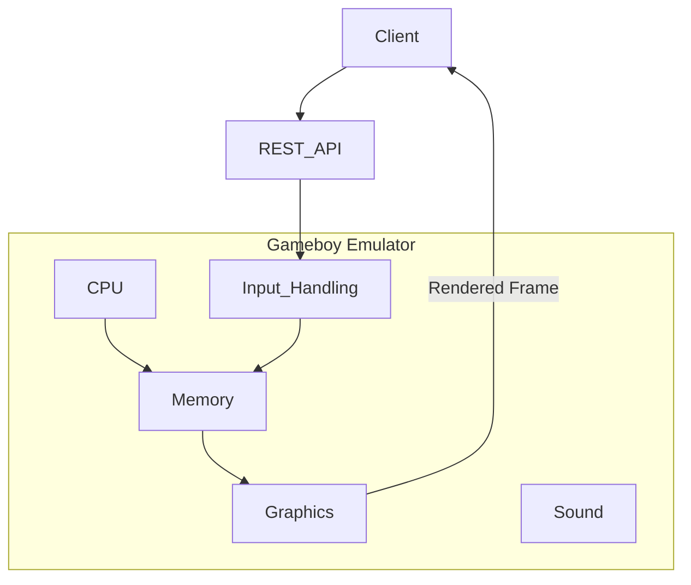

# Purpose

A GAMEBOY emulator that exposes a REST API to control a ROM being played.

**Ultimate Goal**: Play Pokemon RED/BLUE using REST API calls to control the game. And have a GUI navigation agent finish the game.

**Service Context**: The REST API service is intended solely as an interface for a single AI agent, not as a web-scale service. There are no concurrent users or network latency concerns.

# Features
- Gameboy emulator implemented in `emulator` directory. This is going to be a Python project. We should keep the implementation simple and create a minimal emulator that emulates: CPU, graphics, sound and input. (Not interested in emulating Gameboy peripherals.)
- REST api (service) is allowed to be the only mode for input. Ex. JSON payload that tells the emulator to invoke control inputs such as left, right, up, down, etc.
- Graphics should support ROMS that had super gameboy (color) features. (Pokemon Red/Blue are examples)

**Processing Model**: The target games (like Pokemon Red/Blue) progress slowly through discrete actions rather than real-time interactions. The emulator does not need to process at high frame rates or handle concurrent timing requirements.



# Gameboy Hardware

Here are the technical specifications of the Gameboy hardware.

## Technical Specifications

|Component|Game Boy|
|---------|--------|
|CPU|8-bit 8080 Sharp CPU (SM83 core)|
|Master Clock|4.194 MHz|
|System Clock|1/4 of the master clock|
|RAM|8 KiB|
|Video RAM|8 KiB|
|Resolution|160 px x 144 px|
|OBJ Sprites|8x8 or 8x16, max: 40 per screen, 10 per line|
|Color Palettes|BG: 1x4, OBJ: 2x3|
|Colors|4 shades of green|
|Horizontal Sync|9.198 KHz|
|Vertical Sync|59.73 Hz|
|Sound|4 channels with stereo output|

## CPU Registers

| 16-bit | Hi | Lo | Name/Function |
|--------|----|----|---------------|
| AF     | A  | -  | Accumulator & Flags |
| BC     | B  | C  | BC |
| DE     | D  | E  | DE |
| HL     | H  | L  | HL |
| SP     | -  | -  | Stack Pointer |
| PC     | -  | -  | Program Counter/Pointer |


### Flags Register (Lower 8 bits of AF register)

| Bit | Name | Explanation |
|-----|------|-------------|
| 7   | z    | Zero flag |
| 6   | n    | Subtraction flag (BCD) |
| 5   | h    | Half Carry flag (BCD) |
| 4   | c    | Carry flag |

## CPU Instruction Set

All instructions are defined in `Opcodes.json` file. There are unprefixed and cbprefixed instructions.

Definitions:
* **cbprefixed** - Instructions that start with the prefix byte 0xCB, followed by a second byte to determine the specific instruction. This extends the instruction set to provide additional operations like bit manipulation.
* **unprefixed** - Standard 8-bit opcodes ranging from 0x00 to 0xFF that make up the main instruction set of the Gameboy CPU.

The Gameboy CPU uses a two-byte decoding approach:
1. Check if the current opcode is 0xCB (prefix byte)
2. If yes, use the next byte as an index into the prefixed instruction set
3. If no, use the current byte directly in the unprefixed instruction set

This allows for a total of 512 possible instructions (256 unprefixed + 256 cbprefixed).

### Opcodes.json Structure

The `Opcodes.json` file contains metadata for all CPU instructions organized into two top-level objects: `unprefixed` and `cbprefixed`. Each opcode entry is keyed by its hex value (e.g., `"0x00"`, `"0xCB"`) and contains the following fields:

| Field | Type | Description |
|-------|------|-------------|
| `mnemonic` | string | Assembly instruction name (e.g., "NOP", "LD", "JR") |
| `bytes` | number | Total instruction size in bytes, including the opcode and any operands |
| `cycles` | array of numbers | CPU cycles consumed by this instruction. Single element `[4]` for fixed timing. Multiple elements `[8, 12]` for conditional instructions where the first value is the base case (condition false) and subsequent values are for the true case |
| `operands` | array of objects | List of operands for the instruction. Each operand has `name` (register/value name), optional `bytes` (size), and `immediate` (whether it's a direct value vs memory reference) |
| `immediate` | boolean | Whether the instruction uses immediate addressing |
| `flags` | object | How the instruction affects CPU flags (Z, N, H, C). Values: `"-"` (unaffected), `"0"` (reset to 0), `"1"` (set to 1), or the flag letter (e.g., `"Z"`) if the flag is set based on the operation result |

**Example - Fixed cycle instruction:**
```json
"0x00": {
  "mnemonic": "NOP",
  "bytes": 1,
  "cycles": [4],
  "operands": [],
  "immediate": true,
  "flags": { "Z": "-", "N": "-", "H": "-", "C": "-" }
}
```

**Example - Conditional instruction with variable cycles:**
```json
"0x20": {
  "mnemonic": "JR",
  "bytes": 2,
  "cycles": [12, 8],
  "operands": [
    { "name": "NZ", "immediate": true },
    { "name": "r8", "bytes": 1, "immediate": true }
  ],
  "immediate": true,
  "flags": { "Z": "-", "N": "-", "H": "-", "C": "-" }
}
```
In this example, the instruction takes 12 cycles if the jump is taken (NZ condition is true), or 8 cycles if not taken.

### CPU Execution Loop Pseudocode

```
while True:
  opcode_obj = fetch_from_prg(_PC)
  
  # Handle prefixed vs unprefixed opcodes
  if opcode_obj[0] == 0xCB:  # Check if it's a prefixed opcode
    # For cbprefixed instructions, we need to fetch the next byte
    opcode_num = opcode_obj[1]  # Use second byte as opcode for prefixed set
  else:
    # For unprefixed instructions, use first byte directly
    opcode_num = opcode_obj[0]
  
  if opcode_num == ...:
    # do stuff here... (implement the opcode)
```

## How we implement each opcode

The emulator uses a **dispatch table** (a Python dictionary) that maps every opcode value to a dedicated handler method on the `GBCPU` class. 

### 1. Decoding & dispatch
```python
# Example in src/cpu/gb_cpu.py
opcode_handlers = {
    0x00: self._nop,
    0x01: self._ld_bc_d16,
    # …
    0xCB00: self._rlc_b,   # cb‑prefixed opcodes are stored as 0xCBxx
}
```
The main execution loop becomes:

```python
while True:
    opcode = self.fetch_byte(self.pc)
    if opcode == 0xCB:
        opcode = (opcode << 8) | self.fetch_byte(self.pc + 1)
    handler = self.opcode_handlers.get(opcode)
    if handler is None:
        raise NotImplementedError(f'Opcode {opcode:#04x} not implemented')
    handler()
```

### 2. State encapsulation
- **CPU class** holds registers (`self.af`, `self.bc`, …), flags, and the program counter as instance attributes.
- **Memory object** wraps the 64 KB array with `read(addr)` / `write(addr, value)` methods; the CPU keeps a reference to this object. No module‑level globals are used.

### 3. Handler design
Each opcode has its own method (`_nop`, `_ld_bc_d16`, …) that implements the exact semantics, updates registers/memory via the encapsulated state, and returns the number of cycles consumed (optional). Common utilities such as flag manipulation live in private helper methods (`_set_flags`, `_read_word`, etc.) to keep handlers concise.

### 4. Documentation & testing
- Every handler includes a short docstring with the mnemonic, affected registers/flags, and cycle count.
- Unit tests can instantiate `GBCPU` with a mock memory, place an opcode at `PC`, run one loop iteration, and assert the expected state changes.

This approach makes the opcode implementation **readable**, **extensible**, and **easy to test** for future contributors.

## Running Unit Tests

To run unit tests, execute the following command from the project root directory:

```bash
python -m unittest discover tests/
```

All tests are organized under the `tests/` directory structure. The register tests can be found in `tests/cpu/test_registers.py`.

# Memory Map

| Start | End   | Description                          | Notes                                               |
|-------|-------|--------------------------------------|-----------------------------------------------------|
| 0000  | 3FFF  | 16 KiB ROM bank 0                    | From cartridge, usually a fixed bank (if any)       |
| 4000  | 7FFF  | 16 KiB ROM Bank 0-1N                 | From cartridge, switchable bank via mapper (if any) |
| 8000  | 9FFF  | 8 KiB Video RAM (VRAM)               | In CGB mode, switchable bank 0/1                    |
| A000  | BFFF  | 8 KiB External RAM                   | From cartridge, switchable bank if any              |
| C000  | CFFF  | 4 KiB Work RAM (WRAM)                |                                                     |
| D000  | DFFF  | 4 KiB Work RAM (WRAM)                | In CGB mode, switchable bank 1-7                    |
| E000  | FDFF  | Echo RAM (mirror of C000-DDFF)       | Nintendo says use of this area is prohibited.        |
| FE00  | FE9F  | Object attribute memory (OAM)         |                                                     |
| FEA0  | FEFF  | Not Usable                           | Nintendo says use of this area is prohibited.        |
| FF00  | FF7F  | I/O Registers                        |                                                     |
| FF80  | FFFE  | High RAM (HRAM)                      |                                                     |
| FFFF  | FFFF  | Interrupt Enable register (IE)       |                                                     |
