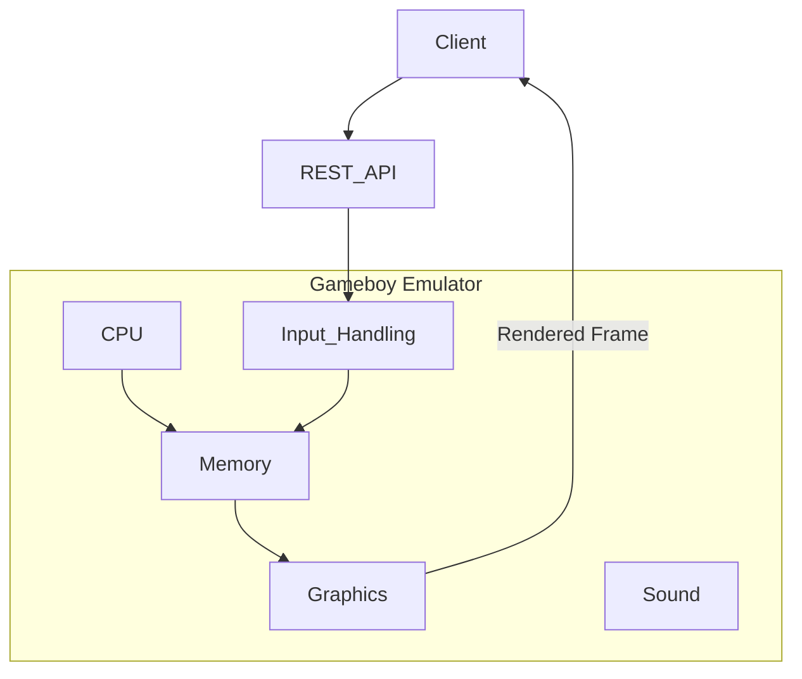

# Purpose

A GAMEBOY emulator that exposes a REST API to control a ROM being played.

**Ultimate Goal**: Play Pokemon RED/BLUE using REST API calls to control the game. And have a GUI navigation agent finish the game.

# Features
- Gameboy emulator implemented in `emulator` directory. This is going to be a Python project. We should keep the implementation simple and create a minimal emulator that emulates: CPU, graphics, sound and input. (Not interested in emulating Gameboy peripherals.)
- REST api (service) is allowed to be the only mode for input. Ex. JSON payload that tells the emulator to invoke control inputs such as left, right, up, down, etc.
- Graphics should support ROMS that had super gameboy (color) features. (Pokemon Red/Blue are examples)

**Processing Model**: The target games (like Pokemon Red/Blue) progress slowly through discrete actions rather than real-time interactions. The emulator does not need to process at high frame rates or handle concurrent timing requirements.



# Gameboy Hardware

Here are the technical specifications of the Gameboy hardware.

## Technical Specifications

|Component|Game Boy|
|---------|--------|
|CPU|8-bit 8080 Sharp CPU (SM83 core)|
|Master Clock|4.194 MHz|
|System Clock|1/4 of the master clock|
|RAM|8 KiB|
|Video RAM|8 KiB|
|Resolution|160 px x 144 px|
|OBJ Sprites|8x8 or 8x16, max: 40 per screen, 10 per line|
|Color Palettes|BG: 1x4, OBJ: 2x3|
|Colors|4 shades of green|
|Horizontal Sync|9.198 KHz|
|Vertical Sync|59.73 Hz|
|Sound|4 channels with stereo output|

## CPU Registers

The Game Boy CPU has the following registers:

**8-bit registers:**
- A (Accumulator)
- B
- C
- D
- E
- H
- L

**16-bit register pairs:**
- AF (A + Flags)
- BC (B + C)
- DE (D + E)
- HL (H + L)

**Special 16-bit registers:**
- SP (Stack Pointer)
- PC (Program Counter)

| 16-bit | Hi | Lo | Name/Function |
|--------|----|----|---------------|
| AF     | A  | -  | Accumulator & Flags |
| BC     | B  | C  | BC |
| DE     | D  | E  | DE |
| HL     | H  | L  | HL |
| SP     | -  | -  | Stack Pointer |
| PC     | -  | -  | Program Counter/Pointer |


### Flags Register (Lower 8 bits of AF register)

| Bit | Name | Explanation |
|-----|------|-------------|
| 7   | z    | Zero flag |
| 6   | n    | Subtraction flag (BCD) |
| 5   | h    | Half Carry flag (BCD) |
| 4   | c    | Carry flag |

## Timer Subsystem

The Game Boy has a hardware timer that counts up and fires an interrupt when it overflows. It gives software a reliable way to schedule work at fixed real-time intervals without busy-looping.

### Why a timer matters

The CPU runs instructions as fast as it can, but games need things to happen at **predictable time intervals** — not "after N instructions" but "every X microseconds." Without a timer:

- **Music stops working** — Pokemon's sound engine advances to the next note on each timer interrupt. No timer, no music timing.
- **RNG breaks** — games read the free-running DIV register as a source of "randomness." It's not truly random, but it's unpredictable from the player's perspective. Pokemon uses DIV for encounter rolls and damage variance.
- **Test ROMs can't validate speed** — Blargg's test ROMs use the timer to detect whether the CPU executes at the correct speed.
- **Anything periodic becomes impossible** — input polling at fixed rates, animation timing, serial transfer timeouts.

### The internal counter

Everything is driven by a single **16-bit counter that increments every T-cycle** (4,194,304 times per second). All four timer registers are just different views of this one counter:

```
Internal counter (16 bits):
  bit 15 .......................... bit 0
  [  DIV (upper 8 bits)  ] [ lower 8 bits ]
```

### Timer registers

| Address | Name | Description |
|---------|------|-------------|
| 0xFF04 | DIV | Upper 8 bits of the internal counter. Effectively increments every 256 T-cycles. Writing ANY value resets the entire 16-bit counter to 0 — you cannot set DIV to a specific value. |
| 0xFF05 | TIMA | Timer counter. Increments at a rate selected by TAC. When it overflows past 0xFF, it reloads from TMA and fires a timer interrupt (IF bit 2). |
| 0xFF06 | TMA | Timer modulo. The value loaded into TIMA on overflow. Controls where counting restarts. |
| 0xFF07 | TAC | Timer control. Bit 2 enables/disables TIMA counting. Bits 1-0 select the clock speed. Upper 5 bits always read as 1. |

### Clock speed selection (TAC bits 1-0)

TIMA doesn't count every cycle — it increments when a specific bit of the internal counter **falls from 1 to 0** (a falling edge). The TAC clock select chooses which bit:

| TAC bits 1-0 | Monitored bit | TIMA ticks every | Frequency |
|---|---|---|---|
| 00 | bit 9 | 1024 T-cycles | 4,096 Hz |
| 01 | bit 3 | 16 T-cycles | 262,144 Hz (fastest) |
| 10 | bit 5 | 64 T-cycles | 65,536 Hz |
| 11 | bit 7 | 256 T-cycles | 16,384 Hz |

### Falling edge detection

This is the key subtlety. The hardware doesn't simply count "every N cycles." It watches a specific bit of the internal counter and increments TIMA the instant that bit transitions 1→0. This matters because **writing to DIV resets the whole counter**, which can force a falling edge mid-count and cause an unexpected TIMA increment. Games and test ROMs rely on this quirk, so the implementation must be per-cycle:

```python
old_bit = (old_counter >> clock_bit) & 1
new_bit = (new_counter >> clock_bit) & 1

if old_bit == 1 and new_bit == 0:
    tima += 1  # Falling edge detected
```

### Overflow behavior

When TIMA increments past 0xFF:
1. TIMA is reloaded with the value in TMA
2. Bit 2 of the IF register (0xFF0F) is set, requesting a timer interrupt

The CPU services this interrupt (if IME is enabled and IE bit 2 is set) by jumping to the timer interrupt vector at **0x0050**.

### Implementation files

| File | Purpose |
|------|---------|
| `src/timer/gb_timer.py` | Timer class with internal counter, falling edge detection, interrupt request |
| `tests/timer/test_gb_timer.py` | Register access, DIV counting, TIMA at all clock rates, overflow/reload, CPU integration |

## Serial Port

The Game Boy has a simple serial port with two registers used for link cable communication. In our emulator, it serves as a **debug output channel** for test ROMs.

### How Blargg's tests use serial

Blargg's cpu_instrs test ROMs output their results by writing one character at a time to the serial port: write the byte to SB, then write 0x81 to SC (start transfer with internal clock). Our Serial class captures each transmitted byte into a buffer that can be read back as an ASCII string.

### Serial registers

| Address | Name | Description |
|---------|------|-------------|
| 0xFF01 | SB | Serial transfer data — the byte to send/receive |
| 0xFF02 | SC | Serial control — bit 7: transfer start, bit 0: internal clock select |

A transfer is triggered when SC is written with both bit 7 (start) and bit 0 (internal clock) set — value 0x81. The byte in SB is captured, and bit 7 of SC is cleared to signal transfer complete.

### Implementation files

| File | Purpose |
|------|---------|
| `src/serial/serial.py` | Serial class with SB/SC registers and output capture buffer |
| `tests/serial/test_serial.py` | Register access, transfer protocol, memory integration |

## Joypad

The Game Boy has 8 buttons but only one 8-bit register (P1/JOYP at 0xFF00) to read them through. The hardware solves this with **select-line multiplexing**: the CPU writes to the register to choose which button group to read, then reads the same register to get the button state.

### Why everything is active-low

The joypad hardware uses pull-up resistors. When no button is pressed, the line is pulled high (1). Pressing a button grounds the line (0). This means **0 = pressed/selected** and **1 = not pressed/not selected** throughout the entire register. This is counterintuitive but faithful to the electrical design.

### The two button groups

The 8 buttons are split into two groups of 4, sharing the same 4 data lines (bits 0-3):

| Group | Selected by | Bit 3 | Bit 2 | Bit 1 | Bit 0 |
|-------|------------|-------|-------|-------|-------|
| **D-pad** | Bit 4 = 0 | Down | Up | Left | Right |
| **Action** | Bit 5 = 0 | Start | Select | B | A |

### Register layout (0xFF00)

```
Bit 7: Unused (always reads 1)
Bit 6: Unused (always reads 1)
Bit 5: P15 — select action buttons  (0 = selected)  [ACTIVE LOW, ACTIVE LOW, WRITE]
Bit 4: P14 — select d-pad            (0 = selected)  [WRITE]
Bit 3: Down  / Start                  (0 = pressed)   [READ-ONLY]
Bit 2: Up    / Select                 (0 = pressed)   [READ-ONLY]
Bit 1: Left  / B                      (0 = pressed)   [READ-ONLY]
Bit 0: Right / A                      (0 = pressed)   [READ-ONLY]
```

Bits 4-5 are the only writable bits. Bits 0-3 are read-only and reflect button state based on which group is selected. Bits 6-7 are unused and always read as 1.

### How games read input

Games use a two-step polling sequence, typically once per frame during V-Blank:

```
; Step 1: Read d-pad
LD A, $20       ; bit 5=1 (deselect action), bit 4=0 (select d-pad)
LDH ($00), A    ; write to P1
LDH A, ($00)    ; read back — bits 0-3 now reflect d-pad state
AND $0F         ; mask lower nibble → d-pad result

; Step 2: Read action buttons
LD A, $10       ; bit 5=0 (select action), bit 4=1 (deselect d-pad)
LDH ($00), A    ; write to P1
LDH A, ($00)    ; read back — bits 0-3 now reflect action button state
AND $0F         ; mask lower nibble → action result
```

The game combines both results into a full 8-button state word for its input handling logic.

### Select line combinations

| Bits 5-4 | Meaning | Bits 0-3 return |
|----------|---------|-----------------|
| `10` (0x20) | D-pad selected | D-pad button state |
| `01` (0x10) | Action selected | Action button state |
| `11` (0x30) | Neither selected (idle) | All 1s (no buttons) |
| `00` (0x00) | Both selected | AND of both groups (0 if either group's button pressed) |

The "both selected" case is rarely used by games but must be handled correctly — the data lines are physically connected, so pressing a button in either group pulls the shared line low.

### Joypad interrupt (IF bit 4)

When any button transitions from not-pressed to pressed (bit goes from 1 to 0), the hardware sets IF bit 4. This fires the joypad interrupt if IE bit 4 is also set and IME is enabled.

The primary use of this interrupt is **waking from STOP mode** — the Game Boy's deep sleep state used for battery saving. Most games (including Pokemon) don't enable the joypad interrupt for normal input handling; they poll 0xFF00 every frame instead.

The interrupt vector is at **0x0060** (lowest priority of all 5 interrupt sources).

### Implementation files

| File | Purpose |
|------|---------|
| `src/joypad/joypad.py` | Joypad class with button state, select-line multiplexing, interrupt firing |
| `tests/joypad/test_joypad.py` | Register read/write, all 8 buttons, multiplexing, interrupts, memory/GameBoy integration |

## Cartridge and Memory Bank Controllers (MBCs)

The Game Boy CPU can only address 32 KB of ROM (0x0000-0x7FFF). Games larger than 32 KB use an **MBC chip** on the cartridge to swap 16 KB ROM banks into the 0x4000-0x7FFF window. Some MBCs also provide external RAM (0xA000-0xBFFF) and hardware features like a real-time clock.

### Architecture: Strategy Pattern

The `Cartridge` class owns header parsing, ROM data, and checksum validation. Banking logic is delegated to an MBC strategy object (`self._mbc`), selected at load time based on the cartridge type byte (0x0147):

| Cartridge type | MBC class | Features |
|----------------|-----------|----------|
| 0x00 | `NoMBC` | ROM ONLY, flat access, writes ignored |
| 0x01-0x03 | `MBC1` | 5-bit ROM bank (32 banks max), 2-bit RAM bank, banking mode |
| 0x0F-0x13 | `MBC3` | 7-bit ROM bank (128 banks max), 4 RAM banks, optional RTC |

Both `Cartridge.read()` and `Cartridge.write()` delegate to `self._mbc.read()` / `self._mbc.write()`. The Memory bus dispatches 0x0000-0x7FFF and 0xA000-0xBFFF to the cartridge.

### MBC1

- **ROM banking:** Lower 5 bits of write to 0x2000-0x3FFF select ROM bank. Bank 0 maps to bank 1 (hardware quirk). Wraps modulo number of banks.
- **RAM banking:** 2-bit bank select via 0x4000-0x5FFF. Up to 4 banks (32 KB).
- **Banking mode:** Bit 0 of write to 0x6000-0x7FFF selects ROM mode (0) or RAM mode (1).
- **RAM enable:** Write 0x0A to 0x0000-0x1FFF to enable, any other value to disable.

### MBC3

- **ROM banking:** Lower 7 bits of write to 0x2000-0x3FFF. Bank 0→1 quirk. Up to 128 banks (2 MB).
- **RAM banking:** Write 0x00-0x03 to 0x4000-0x5FFF selects one of 4 RAM banks (8 KB each).
- **RTC register select:** Write 0x08-0x0C to 0x4000-0x5FFF maps the 0xA000-0xBFFF window to an RTC register instead of RAM.
- **RTC registers:**

| Value | Register | Range |
|-------|----------|-------|
| 0x08 | Seconds | 0-59 |
| 0x09 | Minutes | 0-59 |
| 0x0A | Hours | 0-23 |
| 0x0B | Day Low | 0-255 (lower 8 bits of day counter) |
| 0x0C | Day High | bit 0: day bit 8, bit 6: halt, bit 7: day overflow (>511) |

- **RTC latch:** Write 0x00 then 0x01 to 0x6000-0x7FFF freezes the current time into the readable registers. The clock keeps ticking in the background.
- **RTC timekeeping:** Uses host `time.time()` rather than T-cycle counting. On latch, computes elapsed seconds since the base timestamp and decomposes into S/M/H/D.
- **RAM enable:** Same as MBC1 (write 0x0A to 0x0000-0x1FFF).

### Implementation files

| File | Purpose |
|------|---------|
| `src/cartridge/gb_cartridge.py` | Cartridge class — header parsing, ROM data, delegates to MBC strategy |
| `src/cartridge/mbc.py` | MBC strategy classes: `NoMBC`, `MBC1`, `MBC3` |
| `src/memory/gb_memory.py` | Memory bus — dispatches 0x0000-0x7FFF and 0xA000-0xBFFF to cartridge |
| `tests/cartridge/test_gb_cartridge.py` | Header parsing, checksum, error handling |
| `tests/cartridge/test_mbc1.py` | MBC1 ROM/RAM banking, registers, memory integration |
| `tests/cartridge/test_mbc3.py` | MBC3 ROM banking, RAM, RTC (latch/halt/overflow/write), memory integration (44 tests) |

## Frontend and Timing

The emulator includes a pygame-based GUI frontend that renders the PPU framebuffer in real-time and maps keyboard input to the joypad. The frontend is a thin layer — the GameBoy core has no knowledge of it.

### Frame-based timing

The Game Boy's master clock runs at 4,194,304 Hz. One complete video frame takes 154 scanlines × 456 T-cycles = **70,224 T-cycles**, yielding a natural frame rate of ~59.73 fps (~16.74ms per frame).

The frontend uses a **run-one-frame-then-sleep** timing model:

```
while running:
    frame_start = time.perf_counter()

    handle_input_events()                              # poll keyboard → joypad

    target = gb.cpu.current_cycles + 70_224            # one frame worth of cycles
    gb.run(max_cycles=target)                          # emulate until target reached

    render_framebuffer_to_window()                     # blit PPU output to pygame

    elapsed = time.perf_counter() - frame_start
    remaining = 0.01674 - elapsed                      # ~16.74ms frame budget
    if remaining > 0:
        time.sleep(remaining)                          # throttle to real-time
```

The CPU's `run(max_cycles)` uses `current_cycles` as an absolute monotonic counter — it exits when `current_cycles >= max_cycles`. Each frame we read `current_cycles` fresh and add 70,224 to compute the next target. The CPU may overshoot by one instruction's worth of cycles (4-16), which is automatically accounted for since the next frame reads the actual counter value.

If the emulation is too slow to complete a frame within 16.74ms (Python runs the CPU at ~2 MHz, vs the Game Boy's 4.19 MHz), the sleep is skipped and the game runs at whatever speed the host can manage — roughly half real-time.

### Rendering

The PPU produces a 160×144 framebuffer of shade values (0-3). The frontend maps these to the classic DMG green palette:

| Shade | RGB | Appearance |
|-------|-----|------------|
| 0 | (155, 188, 15) | Lightest (off/white) |
| 1 | (139, 172, 15) | Light |
| 2 | (48, 98, 48) | Dark |
| 3 | (15, 56, 15) | Darkest (on/black) |

The framebuffer is drawn pixel-by-pixel onto a native 160×144 pygame surface, then scaled up to the window size (default 3x = 480×432).

### Keyboard mapping

| Key | Game Boy Button |
|-----|-----------------|
| W / A / S / D | Up / Left / Down / Right |
| K | A |
| J | B |
| Enter | Start |
| Delete | Select |
| Escape | Quit |

### Modularity for future frontends

The frontend interacts with the GameBoy core through three existing interfaces:

1. **`gb.run(max_cycles=target)`** — advance emulation by one frame
2. **`gb.get_framebuffer()`** — read the PPU's 160×144 shade array
3. **`gb.joypad.press(button)` / `gb.joypad.release(button)`** — inject input

A future HTML5 frontend would POST button presses to a REST API that calls the same `press()`/`release()` methods, and serve the framebuffer as image data. No abstract base class is needed — the GameBoy class itself is the stable interface.

### Post-boot state

The `GameBoy.init_post_boot_state()` method sets all CPU registers and memory to the values the boot ROM leaves behind, allowing the emulator to skip the boot ROM and jump directly to the cartridge entry point at 0x0100. Both `run_pygame.py` and `run_tetris.py` use this shared helper.

### Implementation files

| File | Purpose |
|------|---------|
| `src/frontend/pygame_frontend.py` | PygameFrontend class — rendering, input, timing loop |
| `run_pygame.py` | Runner script for interactive play (`python run_pygame.py rom/Tetris.gb`) |
| `tests/frontend/test_pygame_frontend.py` | Palette, key mapping, timing constants, event handling, post-boot state tests |

## System Initialization (GameBoy class)

The `GameBoy` class in `src/gameboy.py` centralizes the initialization of all hardware components. Without it, callers must know the exact sequence of constructor calls and `load_*()` methods — a fragile setup that silently breaks if the order changes.

### Initialization order

The order matters because components have cross-references:

| Step | What | Why this order |
|------|------|----------------|
| 1 | Create Memory | Shared bus — everything reads/writes through it |
| 2 | Create CPU | Constructor sets `memory._cpu` for interrupt register dispatch (IF/IE) |
| 3 | load_timer() | Needs Memory (for IF writes) AND CPU (for tick reference). Wires three cross-references. |
| 4 | load_serial() | Needs Memory for I/O dispatch. No other cross-references. |
| 5 | load_joypad() | Needs Memory for I/O dispatch and IF writes (joypad interrupt). |
| 6 | load_ppu() | Needs Memory (for IF writes on V-Blank) AND CPU (for tick reference). Same pattern as Timer. |
| 7 | load_cartridge() | Optional, at runtime. Only affects Memory read/write for ROM range. |

### Usage

```python
from src.gameboy import GameBoy

gb = GameBoy()
gb.load_cartridge("rom/Tetris.gb")
gb.run(max_cycles=1000000)
print(gb.get_serial_output())  # Read test ROM results
```

### Implementation files

| File | Purpose |
|------|---------|
| `src/gameboy.py` | GameBoy class — owns and wires Memory, CPU, Timer, Serial, Joypad, PPU, Cartridge |
| `tests/test_gameboy.py` | Initialization wiring, timer/serial/cartridge integration through GameBoy |

# CPU Implementation Deep Dive

This section is a comprehensive guide for anyone onboarding to the CPU codebase. It explains the architecture, the execution model, how to read the code, how to implement new opcodes, and the tricky parts that will trip you up if you're not careful.

## Reading the Code: Where to Start

**`gb_cpu.py` is NOT structured top-down.** If you open it and start reading from line 1, you'll see:

1. A tiny `Registers` class (6 fields)
2. ~250 lines of imports from handler files
3. The `Interrupts` class
4. The `CPU` class with a massive dispatch table
5. Register/flag accessor methods
6. The `run()` method at the very bottom

The natural instinct is to read top-to-bottom. Don't. Here's the recommended reading order:

### Step 1: Understand the execution loop (`run()` at line 936)

This is the heart of the CPU. Everything else exists to serve this method. Read it first, and you'll understand the entire architecture.

### Step 2: Look at the dispatch table (`opcode_handlers` at line 382)

This is the map from opcode byte values to handler functions. It answers: "when the CPU encounters byte `0x80`, what function runs?"

### Step 3: Pick one simple handler and trace through it

Start with `nop` in `misc_handlers.py` (the simplest possible handler), then look at `add_a_b` in `arith_handlers.py` (a typical handler that reads registers, computes, sets flags).

### Step 4: Read the Opcodes.json structure

Open `Opcodes.json` and look at one entry. This is where the CPU gets its instruction metadata (byte count, cycle count, operand layout).

### Step 5: Then read the interrupt system

Only after you understand normal instruction execution should you look at the interrupt machinery. It's layered on top of the basic fetch-decode-execute loop.

## The Execution Loop

The `run()` method implements a classic **fetch-decode-execute** cycle. Here's what happens on each iteration, in plain English:

```
1. Check if we've used enough cycles (budget check)
2. If CPU is halted, idle until an interrupt wakes it
3. Check for pending interrupts and service them if IME is set
4. Fetch the opcode byte from memory[PC], advance PC
5. Look up the opcode in Opcodes.json to get metadata
6. For each operand in the metadata:
   - If it has a "bytes" field: fetch that many bytes from the instruction stream
   - If it's a register: just record the register name
7. Dispatch to the handler function
8. The handler returns a cycle count; accumulate it
9. Handle any delayed EI (interrupt enable)
10. Loop back to step 1
```

### The cycle budget

```python
def run(self, max_cycles=-1):
    while True:
        if max_cycles >= 0 and self.current_cycles >= max_cycles:
            break
```

`current_cycles` is cumulative across multiple `run()` calls. It tracks the total cycles the CPU has consumed since creation. The `max_cycles` parameter says "stop when you've reached this total." This means if you call `run(max_cycles=8)` twice, the second call does nothing — the CPU already consumed 8 cycles on the first call.

This is a common gotcha in tests. If your test calls `run()` multiple times, remember that `current_cycles` doesn't reset between calls.

### Fetch and decode

```python
opcode = self.fetch()  # Read memory[PC], PC += 1

if opcode == 0xCB:
    # CB prefix: fetch second byte, look up in cbprefixed table
    opcode = self.fetch_byte(self.registers.PC)
    self.registers.PC += 1
    opcode_info = self.opcodes_db["cbprefixed"].get(f"0x{opcode:02X}")
else:
    opcode_info = self.opcodes_db["unprefixed"].get(f"0x{opcode:02X}")
```

The CPU reads one byte. If it's `0xCB`, it reads a second byte and uses the CB-prefixed table. Otherwise, it uses the unprefixed table. The `opcode_info` dictionary comes directly from `Opcodes.json` and contains the instruction's mnemonic, operand list, cycle count(s), and flag effects.

### The operand pipeline

This is the most subtle part of the execution loop. Before calling the handler, the `run()` loop pre-fetches all operands into `cpu.operand_values`:

```python
self.operand_values = []

for operand in opcode_info["operands"]:
    if "bytes" in operand:
        # This operand needs data from the instruction stream
        # Fetch 1 or 2 bytes, advance PC
        fetched_value = self.fetch_byte(self.registers.PC)  # or fetch_word
        self.registers.PC += operand["bytes"]
        self.operand_values.append({
            "name": operand["name"],
            "value": fetched_value,
            "immediate": operand["immediate"],
            "type": "immediate_value" or "immediate_address",
        })
    else:
        # Register operand — no bytes to fetch
        self.operand_values.append({
            "name": operand["name"],      # e.g. "B", "HL"
            "value": operand["name"],      # same as name for registers
            "immediate": operand["immediate"],
            "type": "register" or "register_indirect",
        })
```

By the time the handler runs, `cpu.operand_values` is a list of dictionaries with everything the handler needs. The handler never touches `PC` or fetches bytes — that's all done for it.

**The key insight:** The `"bytes"` field in `Opcodes.json` is what determines whether an operand needs data fetched from memory. NOT the `"immediate"` field. The `"immediate"` field means something different — see the gotchas section below.

### Dispatch

```python
if is_cb_prefix:
    handler = self.cb_opcode_handlers.get(opcode)
else:
    handler = self.opcode_handlers.get(opcode)

cycles_used = handler(self, opcode_info)
self.current_cycles += cycles_used
```

Two dispatch tables. Unprefixed handlers are individual function references (one per opcode). CB-prefixed handlers are a generated table mapping 256 entries to just 11 functions.

## Understanding Opcodes.json

Every instruction the CPU can execute is described in `Opcodes.json`. Here's a representative entry:

```json
"0x86": {
    "mnemonic": "ADD",
    "bytes": 1,
    "cycles": [8],
    "operands": [
        {"name": "A", "immediate": true},
        {"name": "HL", "immediate": false}
    ],
    "flags": {"Z": "Z", "N": "0", "H": "H", "C": "C"}
}
```

This is `ADD A, (HL)` — add the byte at memory address HL to register A.

### Decoding the fields

| Field | Meaning |
|-------|---------|
| `mnemonic` | The assembly instruction name |
| `bytes` | Total instruction size including opcode (1 = no operand bytes, 2 = 1 operand byte, 3 = 2 operand bytes) |
| `cycles` | Array of cycle counts. One entry for unconditional, two for conditional (taken/not-taken) |
| `operands` | List of operand descriptors |
| `flags` | How each flag is affected: `"-"` = unchanged, `"0"` = cleared, `"1"` = set, `"Z"/"H"/"C"` = computed |

### The `immediate` field (this WILL confuse you)

The `"immediate"` field on an operand does NOT mean "fetch from instruction stream." It means:

- **`true` on a register** = direct register reference (e.g., `A` in `ADD A, B`)
- **`false` on a register** = register indirect / memory access (e.g., `HL` in `ADD A, (HL)` means "the byte at memory[HL]")
- **`true` on a data operand** = immediate value (e.g., `n8` in `ADD A, 0x42`)
- **`false` on a data operand** = memory address (e.g., `a16` in `LD A, (0xFF80)`)

The ONLY way to know if an operand needs bytes fetched from the instruction stream is the `"bytes"` field. If `"bytes"` is present, fetch that many bytes. If absent, it's a register — no fetching needed.

### Conditional cycle counts

Conditional instructions (JP NZ, CALL Z, RET NC, JR C, etc.) have two cycle counts:

```json
"0xC2": {
    "mnemonic": "JP",
    "cycles": [16, 12],
    "operands": [{"name": "NZ", "immediate": true}, {"name": "a16", "bytes": 2, ...}]
}
```

- `cycles[0]` = 16 = condition met, jump taken
- `cycles[1]` = 12 = condition not met, fall through

The handler checks the flag and returns the appropriate cycle count.

## Implementing an Opcode: Step by Step

### Example 1: The simplest handler (NOP)

`NOP` does nothing. It exists in `misc_handlers.py`:

```python
def nop(cpu, opcode_info):
    """NOP - No operation"""
    return opcode_info["cycles"][0]
```

That's it. No register changes, no flags, just return the cycle count (4).

To wire it up, it's imported in `gb_cpu.py` and added to the dispatch table:

```python
from src.cpu.handlers.misc_handlers import nop
# ...
self.opcode_handlers = {
    0x00: nop,
    # ...
}
```

### Example 2: A typical arithmetic handler (ADD A, B)

```python
def add_a_b(cpu, opcode_info) -> int:
    """ADD A, B - Add B to A"""
    a = cpu.get_register("A")
    b = cpu.get_register("B")
    result = a + b

    cpu.set_flag("Z", (result & 0xFF) == 0)
    cpu.set_flag("N", False)
    cpu.set_flag("H", ((a & 0xF) + (b & 0xF)) > 0xF)
    cpu.set_flag("C", result > 0xFF)

    cpu.set_register("A", result & 0xFF)
    return opcode_info["cycles"][0]
```

The pattern: read registers, compute, set flags, write result, return cycles.

### Example 3: A handler with an immediate operand (ADD A, n8)

```python
def add_a_n8(cpu, opcode_info) -> int:
    """ADD A, n8 - Add immediate byte to A"""
    a = cpu.get_register("A")
    n8 = cpu.operand_values[1]["value"]  # Pre-fetched by the run loop
    result = a + n8
    # ... set flags, write result ...
    return opcode_info["cycles"][0]
```

The immediate value is already in `cpu.operand_values` — the run loop fetched it. The handler just reads it. Note that `operand_values[0]` is register A (the first operand in `Opcodes.json`), and `operand_values[1]` is the immediate byte.

### Example 4: A conditional handler (JP NZ, a16)

```python
def jp_nz_nn(cpu, opcode_info) -> int:
    """JP NZ, a16 - Jump if Z flag not set"""
    addr = cpu.operand_values[0]["value"]
    if not cpu.get_flag("Z"):
        cpu.registers.PC = addr
        return opcode_info["cycles"][0]  # Taken: 16 cycles
    return opcode_info["cycles"][1]      # Not taken: 12 cycles
```

Two return paths, two cycle counts. Notice the condition code operand ("NZ") is NOT in `operand_values` — the run loop filters it out. The first operand the handler sees is the address.

### The 4-step process for any new opcode

1. **Look up the opcode in Opcodes.json** — get the mnemonic, operands, cycles, flags
2. **Write the handler function** in the appropriate `handlers/*.py` file
3. **Import and register** in `gb_cpu.py`'s dispatch table
4. **Write tests** verifying register state, flags, PC advancement, and cycle count

## The Interrupt System

Interrupts are the most complex part of the CPU. They break the clean fetch-decode-execute model by injecting external events between instructions.

### How interrupts work

The Game Boy has 5 interrupt sources, checked in priority order:

| Priority | Type | IF bit | Handler Address |
|----------|------|--------|-----------------|
| 1 (highest) | V-Blank | bit 0 | 0x0040 |
| 2 | LCD STAT | bit 1 | 0x0048 |
| 3 | Timer | bit 2 | 0x0050 |
| 4 | Serial | bit 3 | 0x0058 |
| 5 (lowest) | Joypad | bit 4 | 0x0060 |

Two memory-mapped registers control interrupts:
- **IF (0xFF0F)**: Interrupt Flag — which interrupts are pending (hardware sets these bits)
- **IE (0xFFFF)**: Interrupt Enable — which interrupts the program wants to receive

An interrupt fires when: `IME == true` AND `(IF & IE) != 0` for that bit.

### The interrupt service routine

When an interrupt fires, the CPU:
1. Disables IME (prevents nested interrupts)
2. Pushes the current PC onto the stack
3. Jumps to the handler address
4. Clears the IF bit for that interrupt
5. Consumes 20 cycles

The game's interrupt handler routine eventually executes `RETI`, which pops the return address and re-enables IME.

### Where interrupts happen in the execution loop

```python
while True:
    # 1. Budget check
    if self.current_cycles >= max_cycles:
        break

    # 2. HALT idle loop (if halted, spin until interrupt pending)
    if self.interrupts.halted:
        # ...

    # 3. >>> INTERRUPT CHECK HAPPENS HERE <<<
    if self.interrupts.ime:
        interrupt_cycles = self.interrupts.check_interrupts(self)
        if interrupt_cycles > 0:
            self.current_cycles += interrupt_cycles
            continue  # Don't fetch an instruction this iteration

    # 4. Normal fetch-decode-execute
    opcode = self.fetch()
    # ...
```

Interrupts are checked **between** instructions, never in the middle of one. If an interrupt fires, the CPU skips the normal instruction fetch and loops back to the top.

### Why interrupts are difficult

#### Gotcha 1: The EI delay

The `EI` instruction (Enable Interrupts) does NOT enable interrupts immediately. It sets a `ime_pending` flag, and interrupts actually become enabled **after the next instruction executes**. This is faithful to real hardware — games rely on it to execute one more instruction (usually a `RET`) before interrupts can fire.

The implementation uses a three-phase check in the run loop:

```python
# Before instruction: snapshot the pending state
ime_was_pending = self.interrupts.ime_pending

# ... execute instruction ...

# After instruction: if EI was pending before AND still pending now, enable IME
if ime_was_pending and self.interrupts.ime_pending and not self.interrupts.ime_handled_by_instruction:
    self.interrupts.ime = True
    self.interrupts.ime_pending = False
```

The `ime_handled_by_instruction` flag exists because HALT can promote `ime_pending` to `ime` itself, and we don't want the post-instruction check to double-apply it.

#### Gotcha 2: DI cancels pending EI

If the instruction following `EI` is `DI`, the pending enable is canceled. The DI handler clears both `ime` and `ime_pending`:

```python
def di(cpu, opcode_info):
    cpu.interrupts.ime = False
    cpu.interrupts.ime_pending = False  # Cancel pending EI
    return opcode_info["cycles"][0]
```

The post-instruction check in `run()` handles this naturally: `ime_pending` is no longer set, so the `if` condition fails.

#### Gotcha 3: The HALT bug

When `HALT` executes with `IME=0` and there's a pending interrupt (`IF & IE != 0`), the CPU doesn't actually halt AND doesn't service the interrupt. Instead, it has a bug: the next instruction byte is **read twice**. The byte after HALT is fetched, but PC doesn't advance past it — so it gets fetched again as the start of the next instruction.

```python
# In the HALT handler:
if pending and not ime_effective:
    cpu.interrupts.halt_bug = True  # Set the bug flag

# In the run loop, after fetching the next opcode:
if self.interrupts.halt_bug:
    self.registers.PC = (self.registers.PC - 1) & 0xFFFF  # Undo PC increment
    self.interrupts.halt_bug = False
```

This is a real hardware quirk that games (including Pokemon) can trigger.

#### Gotcha 4: HALT with IME=1 and pending interrupt

When HALT executes with `IME=1` and an interrupt is already pending, the CPU doesn't actually enter halt mode — it immediately services the interrupt. The HALT handler detects this case and calls `service_interrupt` directly, returning `4 (HALT) + 20 (interrupt) = 24` cycles.

#### Gotcha 5: HALT idle consumes cycles

When the CPU is halted with no pending interrupts, it doesn't freeze — it spins in an idle loop consuming 4 cycles per iteration until an interrupt becomes pending. This matters for cycle-accurate timing:

```python
if self.interrupts.halted:
    if if_reg & ie_reg:
        self.interrupts.halted = False  # Wake up
    else:
        self.current_cycles += 4  # Idle cycle
        continue
```

### Interrupt state flags summary

| Flag | Set by | Cleared by | Meaning |
|------|--------|------------|---------|
| `ime` | Post-EI delay, RETI | DI, interrupt service | Master enable: can interrupts fire? |
| `ime_pending` | EI handler | DI handler, post-instruction promotion | EI was executed, waiting one instruction |
| `halted` | HALT handler | Interrupt pending (IF & IE), service_interrupt | CPU is in low-power halt |
| `halt_bug` | HALT handler (IME=0 + pending) | Run loop (consumed after one fetch) | Next byte will be read twice |
| `ime_handled_by_instruction` | HALT handler | Run loop (reset each iteration) | Prevents double-promotion of ime_pending |

## CB-Prefixed Instructions: A Case Study in Data-Driven Design

The CB-prefixed instruction set is the best example of how our architecture handles complexity. 256 opcodes are covered by just 11 handler functions and a generated dispatch table.

### What are CB-prefixed instructions?

The SM83 CPU has 256 "unprefixed" opcodes (one byte each). But 256 isn't enough for all the operations the CPU needs. So the designers reserved one opcode — `0xCB` — as an escape prefix. When the CPU encounters `0xCB`, it reads the next byte and uses it as an index into a second 256-entry table.

This doubles the effective instruction set from 256 to 512 opcodes, providing full bit manipulation, shifts, and rotates on all registers — not just the accumulator.

### The CB opcode encoding scheme

The second byte after `0xCB` encodes both the operation and the target:

```
Bits 7-6: Operation group
Bits 5-3: Operation subtype (for groups 01/10/11: bit number)
Bits 2-0: Target register
```

**Target encoding (bits 2-0):**

| Bits | Target |
|------|--------|
| 000 | B |
| 001 | C |
| 010 | D |
| 011 | E |
| 100 | H |
| 101 | L |
| 110 | (HL) — memory indirect |
| 111 | A |

**Operation groups:**

| Byte range | Bits 7-6 | Bits 5-3 | Operation |
|------------|----------|----------|-----------|
| 0x00-0x3F | 00 | 0-7 | Rotate/shift/swap (8 operations) |
| 0x40-0x7F | 01 | bit# | BIT — test bit |
| 0x80-0xBF | 10 | bit# | RES — clear bit |
| 0xC0-0xFF | 11 | bit# | SET — set bit |

The rotate/shift group (0x00-0x3F) encodes 8 different operations in bits 5-3:

| Bits 5-3 | Operation | Mnemonic |
|----------|-----------|----------|
| 0 | Rotate left circular | RLC |
| 1 | Rotate right circular | RRC |
| 2 | Rotate left through carry | RL |
| 3 | Rotate right through carry | RR |
| 4 | Shift left arithmetic | SLA |
| 5 | Shift right arithmetic | SRA |
| 6 | Swap nibbles | SWAP |
| 7 | Shift right logical | SRL |

### Cycle counts

| Target | Rotate/Shift/SWAP | BIT | RES/SET |
|--------|-------------------|-----|---------|
| Register (B,C,D,E,H,L,A) | 8 | 8 | 8 |
| (HL) memory indirect | 16 | 12 | 16 |

BIT on (HL) is only 12 cycles (not 16) because it reads memory but doesn't write back.

### Difference from unprefixed rotates

The Game Boy has 4 unprefixed rotate instructions: RLCA (0x07), RRCA (0x0F), RLA (0x17), RRA (0x1F). These ONLY operate on register A, and they always clear the Z flag — even if A becomes zero.

The CB-prefixed versions (RLC, RRC, RL, RR) operate on **any** of the 8 targets and **set Z if the result is zero**. This is a common source of bugs: if you accidentally reuse the unprefixed rotate logic for CB rotates, the Z flag behavior will be wrong.

### The data-driven implementation

Instead of writing 256 individual handler functions, we use two key observations:

1. **All targets are resolved the same way.** The `Opcodes.json` entry for each CB opcode includes the target as an operand with `"immediate": true` for registers and `"immediate": false` for (HL). The run loop pre-fetches this into `cpu.operand_values`.

2. **The 11 operations have identical structure.** Read target, compute, write target, set flags, return cycles.

This leads to two small helper functions that all 11 handlers share:

```python
def _read_target(cpu, operand):
    """Read value from a CB target (register or memory at HL)."""
    if operand["immediate"]:
        return cpu.get_register(operand["name"])
    else:
        return cpu.memory.get_value(cpu.get_register("HL"))

def _write_target(cpu, operand, value):
    """Write value to a CB target (register or memory at HL)."""
    if operand["immediate"]:
        cpu.set_register(operand["name"], value)
    else:
        cpu.memory.set_value(cpu.get_register("HL"), value)
```

Each handler is then just the operation logic. For example, `RLC`:

```python
def cb_rlc(cpu, opcode_info):
    """RLC - Rotate left circular. Bit 7 goes to carry and bit 0."""
    operand = cpu.operand_values[0]
    value = _read_target(cpu, operand)
    carry = (value >> 7) & 1
    result = ((value << 1) | carry) & 0xFF
    _write_target(cpu, operand, result)
    cpu.set_flag('Z', result == 0)
    cpu.set_flag('N', False)
    cpu.set_flag('H', False)
    cpu.set_flag('C', carry == 1)
    return opcode_info['cycles'][0]
```

This single function handles `RLC B`, `RLC C`, `RLC D`, `RLC E`, `RLC H`, `RLC L`, `RLC (HL)`, and `RLC A` — 8 opcodes. The operand name and `immediate` flag distinguish registers from (HL). The correct cycle count (8 for registers, 16 for (HL)) comes from `Opcodes.json` automatically.

BIT, RES, and SET are slightly different because they have two operands — the bit number and the target:

```python
def cb_bit(cpu, opcode_info):
    """BIT n - Test bit n. Z flag set if bit is 0."""
    bit_num = int(cpu.operand_values[0]["name"])  # "0" through "7"
    operand = cpu.operand_values[1]               # The target register/(HL)
    value = _read_target(cpu, operand)
    cpu.set_flag('Z', (value & (1 << bit_num)) == 0)
    cpu.set_flag('N', False)
    cpu.set_flag('H', True)
    return opcode_info['cycles'][0]
```

This single function handles all 64 BIT opcodes (8 bits x 8 targets).

### The dispatch table generator

The 256-entry dispatch table is built programmatically:

```python
def build_cb_dispatch():
    table = {}
    # Opcodes 0x00-0x3F: 8 rotate/shift/swap ops x 8 targets
    rotate_shift_ops = [cb_rlc, cb_rrc, cb_rl, cb_rr, cb_sla, cb_sra, cb_swap, cb_srl]
    for op_idx, handler in enumerate(rotate_shift_ops):
        for target_idx in range(8):
            table[op_idx * 8 + target_idx] = handler
    # Opcodes 0x40-0x7F: BIT (64 entries)
    for i in range(64):
        table[0x40 + i] = cb_bit
    # Opcodes 0x80-0xBF: RES (64 entries)
    for i in range(64):
        table[0x80 + i] = cb_res
    # Opcodes 0xC0-0xFF: SET (64 entries)
    for i in range(64):
        table[0xC0 + i] = cb_set
    return table
```

The CPU stores this as `self.cb_opcode_handlers` and uses it during dispatch:

```python
if is_cb_prefix:
    handler = self.cb_opcode_handlers.get(opcode)
else:
    handler = self.opcode_handlers.get(opcode)
```

**The result:** 256 opcodes, 11 handler functions, 2 helpers, 1 table generator. All cycle-accurate, all tested against Opcodes.json.

### Naming convention

CB handler functions are prefixed with `cb_` to avoid collisions with the unprefixed rotate instructions: `cb_rlc` vs `rlc_a`, `cb_rr` vs `rr_a`. This matters because the unprefixed versions have different flag behavior (they always clear Z).

## Tips and Tricks

### Tip 1: Use Opcodes.json as your source of truth

Before implementing any opcode, look it up in `Opcodes.json`. Don't rely on memory or external references for cycle counts, flag behavior, or operand layout. We have a test suite (`test_cycle_accuracy.py`) that validates every opcode's cycle count against this file.

### Tip 2: Watch out for the "C" ambiguity

In `Opcodes.json`, the operand name `"C"` can mean register C or the carry flag condition code. The run loop handles this by skipping condition code operands for conditional instructions:

```python
is_conditional = len(opcode_info.get("cycles", [])) > 1
if is_conditional and operand_name in ["Z", "NZ", "C", "NC"]:
    pass  # Skip — these are condition codes, not register operands
```

If you remove the `is_conditional` guard, `LD C, n8` breaks because register C gets skipped.

### Tip 3: Remember that `current_cycles` is cumulative

`cpu.current_cycles` never resets. If a test calls `run(max_cycles=12)` and then `run(max_cycles=24)`, the second call has a budget of 12 more cycles (from 12 to 24), not 24 from scratch.

### Tip 4: Flag calculation is always on the masked result

For 8-bit operations, always mask to `& 0xFF` before checking the zero flag. Python integers are arbitrary precision, so `0xFF + 1 = 256`, which is not zero — but the Game Boy's 8-bit register would contain `0x00`.

### Tip 5: Verify opcode-to-mnemonic mappings

A previous mistake mapped `0x27` to a rotate handler. It's actually DAA (Decimal Adjust Accumulator). The opcodes in the `0x27`/`0x2F`/`0x37`/`0x3F` row are NOT rotates — they're DAA, CPL, SCF, CCF. Always cross-check against `Opcodes.json`.

## File Organization

### Source files

| File | Purpose |
|------|---------|
| `src/cpu/gb_cpu.py` | `Registers`, `Interrupts`, `CPU` classes, dispatch tables, execution loop |
| `src/cpu/handlers/arith_handlers.py` | ADD, ADC, SUB, SBC, ADD SP instructions |
| `src/cpu/handlers/bitwise_handlers.py` | AND, OR, XOR, CP instructions |
| `src/cpu/handlers/cb_handlers.py` | All 256 CB-prefixed instructions (11 handlers + dispatch generator) |
| `src/cpu/handlers/inc_dec_handlers.py` | INC, DEC (8-bit, 16-bit, and (HL) indirect) |
| `src/cpu/handlers/interrupt_handlers.py` | DI, EI, HALT |
| `src/cpu/handlers/jump_handlers.py` | JP, JR, CALL, RET, RETI, RST |
| `src/cpu/handlers/ld_handlers.py` | LD immediate, indirect, absolute, auto-inc/dec |
| `src/cpu/handlers/ld_r1_r2_handlers.py` | LD r1, r2 register-to-register (56 instructions) |
| `src/cpu/handlers/ldh_handlers.py` | LDH high-memory I/O instructions |
| `src/cpu/handlers/misc_handlers.py` | NOP, STOP, SCF, CCF, CPL, DAA |
| `src/cpu/handlers/rotate_handlers.py` | RLCA, RRCA, RLA, RRA (unprefixed A-only rotates) |
| `src/cpu/handlers/stack_handlers.py` | PUSH, POP |
| `src/joypad/joypad.py` | Joypad — P1/JOYP register, button state, select-line multiplexing, interrupt |
| `src/memory/gb_memory.py` | Memory bus with I/O register dispatch (joypad, serial, timer, cartridge) |
| `src/cartridge/gb_cartridge.py` | Cartridge class — ROM loading, header parsing, MBC1 bank switching |
| `src/ppu/ppu.py` | PPU — registers, mode state machine, V-Blank interrupt, LYC coincidence |
| `src/timer/gb_timer.py` | Timer subsystem — internal counter, TIMA, DIV, interrupt firing |
| `src/serial/serial.py` | Serial port — SB/SC registers, Blargg output capture |
| `src/frontend/pygame_frontend.py` | Pygame GUI frontend — rendering, input mapping, frame-based timing |
| `src/gameboy.py` | GameBoy class — system bootstrap, owns all components, post-boot state init |
| `Opcodes.json` | Authoritative opcode reference (~2.5MB) |

### Test files

| File | What it tests |
|------|---------------|
| `tests/cpu/test_cycle_accuracy.py` | Every opcode's cycle count vs Opcodes.json (~500 checks) |
| `tests/cpu/test_cb_opcodes.py` | CB-prefixed operations: all 11 types, register + (HL) targets, flags |
| `tests/cpu/test_interrupts.py` | Interrupt system: EI delay, HALT, HALT bug, priority, chaining |
| `tests/cpu/test_jump_instructions.py` | JP, JR, CALL, RET, RETI, RST |
| `tests/cpu/test_bitwise_ops.py` | AND, OR, XOR, CP |
| `tests/cpu/test_rotate_ops.py` | RLCA, RRCA, RLA, RRA |
| `tests/cpu/test_ld_r1_r2.py` | Register-to-register LD instructions |
| `tests/cpu/test_load_store.py` | LD immediate, indirect, absolute, auto-inc/dec |
| `tests/cpu/test_remaining_opcodes.py` | Conditional JP, ADC n8, ADD SP, DAA |
| `tests/cpu/test_fetch_with_operands.py` | Opcodes with operands |
| `tests/cpu/test_fetch_opcodes_only.py` | Opcodes without operands |
| `tests/cpu/test_registers.py` | Register access |
| `tests/cpu/test_stack.py` | Stack operations |
| `tests/cpu/test_flags.py` | Flag manipulation |
| `tests/memory/test_gb_memory.py` | Memory read/write, echo RAM, address mapping |
| `tests/cartridge/test_gb_cartridge.py` | Header parsing, ROM access, checksum validation |
| `tests/cartridge/test_mbc1.py` | MBC1 bank switching: ROM banking, RAM banking, mode select |
| `tests/ppu/test_ppu.py` | Register defaults/read/write, mode timing, STAT flags, V-Blank interrupt, STAT interrupts, CPU integration, BG/window/sprite rendering, OAM DMA, VRAM/OAM access restrictions, ASCII output |
| `tests/timer/test_gb_timer.py` | DIV counting, TIMA clock rates, overflow/reload, CPU integration |
| `tests/serial/test_serial.py` | Register access, transfer protocol, memory integration |
| `tests/joypad/test_joypad.py` | Register read/write, button press/release, select-line multiplexing, interrupts, memory/GameBoy integration |
| `tests/frontend/test_pygame_frontend.py` | DMG palette, key mapping, timing constants, frame cycle advancement, event handling, post-boot state |
| `tests/test_gameboy.py` | GameBoy initialization wiring, component integration |

### Running tests

```bash
# All tests (681 tests)
python -m unittest discover tests/ -v

# CPU tests only (388 tests)
python -m unittest discover tests/cpu -v

# PPU tests (122 tests)
python -m unittest discover tests/ppu -v

# Joypad tests (34 tests)
python -m unittest discover tests/joypad -v

# Frontend tests (19 tests)
python -m unittest discover tests/frontend -v

# Cartridge tests (55 tests, includes MBC1 bank switching)
python -m unittest discover tests/cartridge -v

# Timer, serial, memory tests
python -m unittest discover tests/timer -v
python -m unittest discover tests/serial -v
python -m unittest discover tests/memory -v

# GameBoy integration tests
python -m unittest tests.test_gameboy -v

# Specific test file
python -m unittest tests.cpu.test_cycle_accuracy -v

# Specific test method
python -m unittest tests.cpu.test_cb_opcodes.TestCBRLC.test_rlc_b -v
```

### Blargg test ROM validation

The CPU passes both Blargg test ROMs, confirming instruction correctness and cycle-accurate timing:

```bash
# Run Blargg cpu_instrs (all 11 sub-tests)
python run_blargg.py rom/cpu_instrs.gb

# Run Blargg instr_timing
python run_blargg.py rom/instr_timing.gb
```

| Test ROM | Sub-tests | Status |
|----------|-----------|--------|
| cpu_instrs | 01: special ops | Passed |
| cpu_instrs | 02: interrupts | Passed |
| cpu_instrs | 03: op sp,hl | Passed |
| cpu_instrs | 04: op r,imm | Passed |
| cpu_instrs | 05: op rp | Passed |
| cpu_instrs | 06: ld r,r | Passed |
| cpu_instrs | 07: jr,jp,call,ret,rst | Passed |
| cpu_instrs | 08: misc instrs | Passed |
| cpu_instrs | 09: op r,r | Passed |
| cpu_instrs | 10: bit ops | Passed |
| cpu_instrs | 11: op a,(hl) | Passed |
| instr_timing | (single test) | Passed |

# PPU Implementation Deep Dive

This section is the comprehensive guide for the PPU codebase — the same kind of "onboarding to development" guide that exists above for the CPU. It explains what the PPU does, how the code is organized, how it connects to the rest of the system, and how to extend it.

## What the PPU Does

The PPU (Pixel Processing Unit) renders the Game Boy's 160x144 pixel display. It runs in parallel with the CPU, drawing the screen one scanline at a time, 59.73 times per second. The CPU and PPU communicate through shared memory (VRAM, OAM) and memory-mapped registers (0xFF40-0xFF4B).

The PPU has three rendering layers that are composited for each pixel:
1. **Background** — a scrollable 256x256 tile map (only 160x144 visible at a time)
2. **Window** — a fixed overlay that draws on top of the background (used for HUDs, menus)
3. **Sprites** (Objects) — individually positioned 8x8 or 8x16 tiles (player character, NPCs, items)

### Key concept: Tiles are NOT pixels

A tile is an 8x8 grid of **2-bit color indices** (0-3), not actual colors. Each pixel in a tile is 2 bits, so one 8-pixel row = 2 bytes, and one full 8x8 tile = 16 bytes.

The indices are mapped to actual shades through a **palette register**:
```
BGP register (0xFF47) = 0xE4 = 0b11_10_01_00
                                 │  │  │  └─ index 0 → shade 0 (white)
                                 │  │  └──── index 1 → shade 1 (light gray)
                                 │  └─────── index 2 → shade 2 (dark gray)
                                 └────────── index 3 → shade 3 (black)
```

This indirection is why the PPU has palette registers — games can remap colors without changing tile data. Pokemon uses this for fade-in/fade-out effects.

### Key concept: Tile maps are grids of tile indices

The background and window don't store pixel data — they store a 32x32 grid of **tile index numbers**. Each byte in the tile map is an index that points to a tile in VRAM. The PPU looks up each index, fetches the corresponding 16-byte tile, and draws it.

Two tile map areas exist in VRAM:
- **0x9800-0x9BFF** — Tile map 0 (32x32 = 1024 bytes)
- **0x9C00-0x9FFF** — Tile map 1 (32x32 = 1024 bytes)

LCDC bit 3 selects which tile map the background uses. LCDC bit 6 selects which one the window uses.

### Key concept: Two tile data addressing modes

Tile data (the actual 8x8 pixel grids) lives at 0x8000-0x97FF (384 tiles × 16 bytes = 6144 bytes). But the tile map indices can reference it in two ways, controlled by LCDC bit 4:

| LCDC bit 4 | Base address | Index type | Range | Index 0 location |
|------------|-------------|------------|-------|-----------------|
| 1 | 0x8000 | Unsigned (0-255) | Tiles 0-255 | 0x8000 |
| 0 | 0x8800 | Signed (-128 to 127) | Tiles -128 to 127 | 0x9000 |

The signed mode is confusing at first: index 0 maps to address 0x9000 (the middle of the tile data area). Positive indices go up from there, negative indices go down. This allows the background and sprites to share tile data — sprites always use unsigned addressing from 0x8000, while the background can use either mode.

## Reading the Code: Where to Start

The PPU code is in `src/ppu/ppu.py` — a single file containing the `PPU` class. It's much simpler than the CPU because it has no dispatch tables or handler functions.

### Step 1: Look at `__init__` (the register declarations)

The PPU has 12 registers plus internal state:
- `_lcdc`, `_stat`, `_scy`, `_scx`, `_ly`, `_lyc`, `_dma`, `_bgp`, `_obp0`, `_obp1`, `_wy`, `_wx` — the memory-mapped registers
- `_dot` — current position within a scanline (0-455)
- `_mode` — current PPU mode (0, 1, 2, or 3)
- `_memory` — reference to the Memory bus (for setting IF bits)
- `_framebuffer` — 160×144 list of lists (shade values 0-3)
- `_window_line` — internal window line counter (resets at frame start)

### Step 2: Read `read()` and `write()`

These are the I/O dispatch methods called by the memory bus. They're straightforward — each register maps to a fixed address. The interesting parts:
- **STAT write mask**: bits 0-2 are read-only (mode + coincidence flag), only bits 3-6 are writable from CPU
- **STAT read**: bit 7 always reads as 1
- **LY**: read-only from CPU; writing resets it to 0

### Step 3: Read `tick()` — the mode state machine

This is the heart of the PPU. It advances the dot counter one T-cycle at a time and triggers mode transitions at specific thresholds. Read this method carefully — it's where all the timing logic lives.

### Step 4: Read the rendering methods

- `_render_scanline()` — renders BG + window + sprites for the current scanline into the framebuffer (called at mode 3→0 transition)
- `_render_sprites()` — OAM scan, priority sort, sprite pixel compositing (called from `_render_scanline()`)
- `_tile_data_address()` — static helper that resolves tile index to VRAM address (unsigned/signed mode)
- `_dma_transfer()` — copies 160 bytes from source page to OAM (triggered by write to 0xFF46)
- `get_framebuffer()` — returns the 160×144 framebuffer
- `render_ascii()` — returns ASCII art visualization of the framebuffer

### Step 5: Read the internal helpers

- `_set_mode()` — updates `_mode` and STAT bits 0-1, triggers STAT IRQ check
- `_update_lyc_flag()` — sets/clears STAT bit 2 based on LY==LYC, triggers STAT IRQ check
- `_update_stat_irq()` — evaluates OR of enabled STAT conditions, fires IF bit 1 on rising edge
- `_request_vblank_interrupt()` — sets IF bit 0 via direct memory access
- `_request_stat_interrupt()` — sets IF bit 1 via direct memory access

## The Mode State Machine

The PPU cycles through four modes for each scanline. This is the timing skeleton that everything else builds on.

### The four modes

```
Scanline 0:   [── Mode 2 ──][──── Mode 3 ────][────── Mode 0 ──────]
              0            80                252                    456
              OAM Scan      Pixel Transfer     H-Blank

Scanline 1:   [── Mode 2 ──][──── Mode 3 ────][────── Mode 0 ──────]
  ...
Scanline 143: [── Mode 2 ──][──── Mode 3 ────][────── Mode 0 ──────]

Scanline 144: [──────────────── Mode 1 ────────────────────────────]
  ...                          V-Blank
Scanline 153: [──────────────── Mode 1 ────────────────────────────]
              └── then back to Scanline 0, Mode 2
```

| Mode | Name | Dots | What happens |
|------|------|------|-------------|
| 2 | OAM Scan | 0-79 (80 cycles) | PPU searches OAM for sprites on this scanline |
| 3 | Pixel Transfer | 80-251 (172 cycles) | PPU reads VRAM and pushes pixels to LCD |
| 0 | H-Blank | 252-455 (204 cycles) | Scanline done, PPU idle, CPU can access VRAM/OAM |
| 1 | V-Blank | Full scanline (456 cycles × 10) | Frame done, CPU can do anything |

Total per scanline: 456 T-cycles. Total per frame: 154 × 456 = 70,224 T-cycles ≈ 59.73 Hz.

### How tick() works

```python
def tick(self, cycles):
    if not (self._lcdc & 0x80):  # LCD disabled
        return

    for _ in range(cycles):
        self._dot += 1

        if self._ly < 144:
            # Visible scanline — transition through modes 2 → 3 → 0
            if self._dot == 80:    self._set_mode(3)    # Enter Pixel Transfer
            elif self._dot == 252:
                self._set_mode(0)                        # Enter H-Blank
                self._render_scanline()                  # Render BG + window
            elif self._dot == 456:                       # End of scanline
                self._dot = 0
                self._ly += 1
                if self._ly == 144:
                    self._set_mode(1)                    # Enter V-Blank
                    self._request_vblank_interrupt()      # IF bit 0
                else:
                    self._set_mode(2)                    # Next scanline
                self._update_lyc_flag()
        else:
            # V-Blank (scanlines 144-153)
            if self._dot == 456:
                self._dot = 0
                self._ly += 1
                if self._ly > 153:
                    self._ly = 0
                    self._set_mode(2)                    # Back to start
                self._update_lyc_flag()
```

Key points:
- The dot counter (`_dot`) counts from 0 to 455 within each scanline, then resets
- Mode transitions happen at fixed dot thresholds (80, 252, 456)
- LY increments at the end of each scanline (dot == 456)
- V-Blank interrupt fires exactly once per frame (when LY transitions to 144)
- When LCD is disabled (LCDC bit 7 = 0), tick() does nothing — the PPU freezes

### LCD disabled behavior

When a game clears LCDC bit 7, the PPU stops entirely. No modes cycle, no interrupts fire, no LY changes. The screen goes blank. Games disable the LCD to safely write to VRAM at any time (since there are no mode restrictions when the PPU is off). Pokemon does this during screen transitions.

## How the PPU Connects to the Rest of the System

### Wiring pattern (same as Timer)

The PPU follows the same wiring pattern as the Timer. `Memory.load_ppu()` does three things:
1. Stores `memory._ppu` for I/O register dispatch (0xFF40-0xFF4B)
2. Sets `ppu._memory` so the PPU can set IF bits (V-Blank interrupt)
3. Sets `cpu._ppu` so the CPU run loop can call `ppu.tick()`

### CPU run loop integration

The CPU calls `ppu.tick(cycles)` in two places — exactly the same as Timer:

```python
# 1. During HALT idle (4 cycles per idle iteration)
if self._ppu:
    self._ppu.tick(4)

# 2. After each instruction
if self._ppu:
    self._ppu.tick(cycles_used)
```

This means the PPU advances in lockstep with the CPU. Every T-cycle the CPU consumes is also fed to the PPU.

### V-Blank interrupt

When the PPU enters V-Blank (LY transitions to 144), it sets bit 0 of the IF register:

```python
def _request_vblank_interrupt(self):
    if self._memory is not None:
        if_val = self._memory.memory[0xFF0F]
        self._memory.memory[0xFF0F] = if_val | 0x01
```

This uses **direct memory array access** (same pattern as Timer) to avoid circular dispatch through `memory.set_value()`.

The CPU's interrupt system then picks this up on the next iteration of the run loop — if IME is enabled and IE bit 0 is set, it services the interrupt by jumping to the V-Blank handler at 0x0040.

## PPU Registers Reference

| Address | Name | Bits | Description |
|---------|------|------|-------------|
| 0xFF40 | LCDC | 7: LCD enable<br>6: Window tile map (0=9800, 1=9C00)<br>5: Window enable<br>4: BG tile data (0=8800 signed, 1=8000 unsigned)<br>3: BG tile map (0=9800, 1=9C00)<br>2: Sprite size (0=8x8, 1=8x16)<br>1: Sprite enable<br>0: BG & Window enable | Master control register. Bit 7 is the LCD on/off switch. |
| 0xFF41 | STAT | 6: LYC interrupt enable<br>5: Mode 2 interrupt enable<br>4: Mode 1 interrupt enable<br>3: Mode 0 interrupt enable<br>2: LYC==LY flag (read-only)<br>1-0: Mode (read-only)<br>7: Always 1 | Status and interrupt configuration. Bits 0-2 are set by hardware. |
| 0xFF42 | SCY | 0-7 | Background scroll Y (0-255, wraps) |
| 0xFF43 | SCX | 0-7 | Background scroll X (0-255, wraps) |
| 0xFF44 | LY | 0-7 | Current scanline (0-153, read-only; write resets to 0) |
| 0xFF45 | LYC | 0-7 | LY compare value |
| 0xFF46 | DMA | 0-7 | OAM DMA source (write 0xNN → copies 0xNN00-0xNN9F to OAM) |
| 0xFF47 | BGP | 7-6: color 3<br>5-4: color 2<br>3-2: color 1<br>1-0: color 0 | Background palette. Maps 2-bit indices to shades. |
| 0xFF48 | OBP0 | Same as BGP | Sprite palette 0 (color 0 = transparent) |
| 0xFF49 | OBP1 | Same as BGP | Sprite palette 1 (color 0 = transparent) |
| 0xFF4A | WY | 0-7 | Window Y position |
| 0xFF4B | WX | 0-7 | Window X position (offset by 7: WX=7 = left edge) |

## VRAM Layout

```
0x8000 ┌──────────────────────┐
       │  Tile Data Block 0   │  128 tiles × 16 bytes = 2048 bytes
       │  (tiles 0-127)       │  Used by sprites (always)
0x8800 ├──────────────────────┤
       │  Tile Data Block 1   │  128 tiles × 16 bytes = 2048 bytes
       │  (tiles 128-255 /    │  Shared between sprites and BG
       │   signed -128 to -1) │
0x9000 ├──────────────────────┤
       │  Tile Data Block 2   │  128 tiles × 16 bytes = 2048 bytes
       │  (signed 0-127)      │  Used by BG in signed mode (LCDC bit 4 = 0)
0x9800 ├──────────────────────┤
       │  Tile Map 0          │  32×32 = 1024 bytes
       │                      │  BG (LCDC bit 3=0) / Window (LCDC bit 6=0)
0x9C00 ├──────────────────────┤
       │  Tile Map 1          │  32×32 = 1024 bytes
       │                      │  BG (LCDC bit 3=1) / Window (LCDC bit 6=1)
0xA000 └──────────────────────┘
```

## OAM (Sprite) Layout

OAM is 160 bytes at 0xFE00-0xFE9F, holding 40 sprite entries of 4 bytes each:

| Byte | Name | Description |
|------|------|-------------|
| 0 | Y position | Sprite Y + 16 (Y=0 means sprite is at Y=-16, off-screen) |
| 1 | X position | Sprite X + 8 (X=0 means sprite is at X=-8, off-screen) |
| 2 | Tile index | Which tile to draw (0-255, always uses 0x8000 unsigned addressing) |
| 3 | Attributes | Bit 7: BG priority, Bit 6: Y-flip, Bit 5: X-flip, Bit 4: palette (OBP0/OBP1) |

The Y/X offsets mean a sprite at position (8, 16) in OAM appears at screen position (0, 0) — the top-left corner.

## Tile Data Encoding

Each tile is 8x8 pixels, 2 bits per pixel, stored as 16 bytes (2 bytes per row). The two bits for each pixel come from two separate bytes — the "low byte" and "high byte" of each row:

```
Row 0: byte 0 (low bits), byte 1 (high bits)
Row 1: byte 2 (low bits), byte 3 (high bits)
...
Row 7: byte 14 (low bits), byte 15 (high bits)
```

To get the 2-bit color index for pixel X in a row:
```python
low_bit  = (low_byte >> (7 - x)) & 1
high_bit = (high_byte >> (7 - x)) & 1
color_index = (high_bit << 1) | low_bit  # 0, 1, 2, or 3
```

Note: pixel 0 (leftmost) uses bit 7 (MSB), pixel 7 (rightmost) uses bit 0 (LSB).

## What's Implemented vs What's Next

### Implemented (PPU feature-complete)
- All 12 PPU registers with correct read/write behavior
- Mode state machine (modes 0-3 cycling at correct T-cycle thresholds)
- LY counter (0-153 with wrap)
- STAT mode bits (0-1) and LYC coincidence flag (bit 2)
- V-Blank interrupt (IF bit 0)
- **STAT interrupts** (IF bit 1) — rising-edge detection for mode 0/1/2 transitions and LYC==LY match, controlled by STAT bits 3-6
- LCD disabled behavior
- CPU integration (tick called from run loop)
- **Background rendering** — tile map lookup (LCDC bit 3), 2bpp tile data decoding, SCX/SCY scroll wrapping, BGP palette application, LCDC bit 4 addressing modes (unsigned 0x8000 / signed 0x8800)
- **Window rendering** — overlay on top of BG, WY/WX positioning (screen X = WX - 7), LCDC bit 5 enable, LCDC bit 6 tile map selection, internal line counter (increments only when window rendered, resets at frame start)
- **Sprite rendering** — OAM scan (40 entries, 10-per-line limit), 8x8/8x16 modes (LCDC bit 2), OBP0/OBP1 palette selection, X/Y flip, transparency (color 0), BG priority (attr bit 7), sprite priority (lower X wins, OAM index tiebreaker), off-screen clipping
- **OAM DMA transfer** — writing to 0xFF46 copies 160 bytes from source page to OAM (instant copy)
- **VRAM/OAM access restrictions** — VRAM returns 0xFF during mode 3, OAM returns 0xFF during modes 2/3; writes silently dropped during restricted modes
- **Framebuffer** — 160×144 array of shade values (0-3), `get_framebuffer()` accessor, `render_ascii()` ASCII visualization
- **`GameBoy.get_framebuffer()`** — top-level accessor delegating to PPU

## Implementation files

| File | Purpose |
|------|---------|
| `src/ppu/ppu.py` | PPU class — registers, mode state machine, interrupts (V-Blank + STAT), BG/window/sprite rendering, OAM DMA, framebuffer |
| `src/memory/gb_memory.py` | Memory bus — includes VRAM/OAM access restrictions by PPU mode |
| `tests/ppu/test_ppu.py` | 122 tests: registers (35), mode timing (14), STAT/LYC (5), V-Blank interrupt (4), LCD disabled (2), CPU integration (2), BG rendering (16), window rendering (7), sprite rendering (14), STAT interrupts (12), OAM DMA (5), VRAM/OAM restrictions (10), ASCII output (2) |
